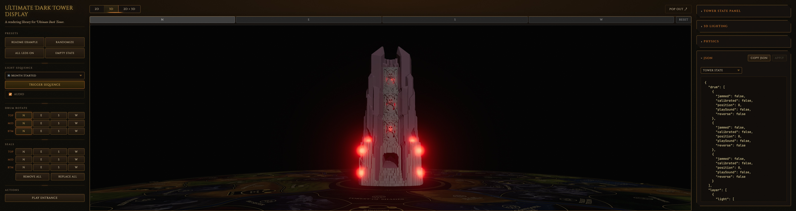
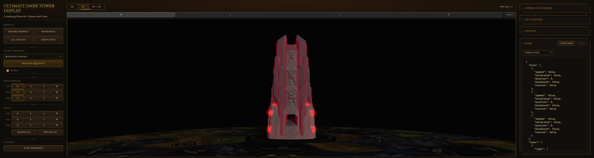
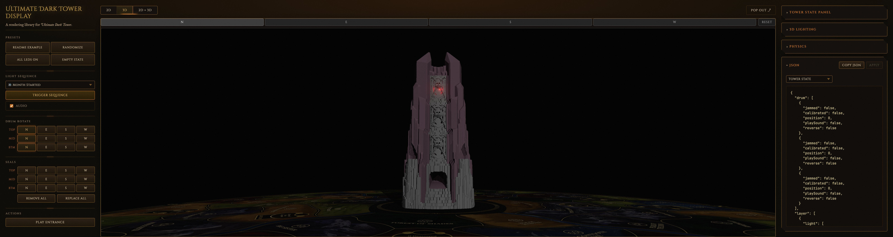

# 4.11 — min-cost-combo

**Branch:** [`lighting/4.11-min-cost-combo`](https://github.com/ChessMess/UltimateDarkTowerDisplay/compare/main...lighting/4.11-min-cost-combo) (code PR is a draft per [§2 of the testing plan](../lighting-testing-plan.md#2-workflow-per-alternative); held until decision time).
**Status:** report-complete
**Implementer:** Chris Koerner (with Claude)
**Captured on:** Apple Silicon Mac (arm64) | macOS 26.4.1 (25E253) | Chrome 148.0.0.0 via chrome-devtools-mcp | 2026-05-24
**Baseline reference:** [`docs/lighting-experiments/00-baseline.md`](00-baseline.md) @ `main@3ab257f`
**three.js version:** `0.184.0` (unchanged from baseline — `DirectionalLight` per-fragment math has been API-stable since r100 / 2018, and the `EffectComposer` / `UnrealBloomPass` pipeline used by the baseline is the same one this branch *bypasses* by flipping `DEFAULT_LIGHTING.scene.bloom.enabled` to `false`; see [lighting-alternatives.md §3](../lighting-alternatives.md#3-three-js-light-types--per-fragment-cost) for the per-fragment cost rationale and [§5.2](../lighting-alternatives.md#52-bloom-pass-cost-is-not-free) for the bloom-pass cost rationale)
**Tools:** `collectPerfReport(3000)` via `mcp__chrome-devtools__evaluate_script`. Supplementary scene-graph traversal via `evaluate_script` to capture `visibleDirectionalLights` (not in `PerfReport`). No chrome-devtools trace overlay.

## Implementation summary

Per [§8.8 of the testing plan](../lighting-testing-plan.md#88-411--min-cost-combo). **§4.11 is the fusion of §4.1 + §4.4 + §4.8** ([lighting-alternatives.md §4.11](../lighting-alternatives.md#411-minimal-cost-combo-drop-bloom--2-directional--bright-proxies)) — drops all 36 LED-related `PointLight`s, adds 2 red `THREE.DirectionalLight`s positioned inside the drum on opposing horizontal axes (continuous-driven by `max(driver.v)`), AND **disables the bloom post-processing pipeline entirely** via a single `DEFAULT_LIGHTING.scene.bloom.enabled = false` flip. Proxy + halo materials stay at the baseline `MeshBasicMaterial({ color: 0xff2020, toneMapped: false })` recipe — without bloom there is no value in pushing colors above 1.0 (HDR-scaled colors would just clamp on display per [§5.1](../lighting-alternatives.md#51-meshbasicmaterial-has-no-emissive)), so "bright `MeshBasicMaterial` proxies" in [§8.8](../lighting-testing-plan.md#88-411--min-cost-combo) means baseline-color + `toneMapped: false` (which already is the baseline rendering).

**Files changed (6 modified; 340 insertions, 161 deletions on branch `lighting/4.11-min-cost-combo` commit [`d6243dd`](https://github.com/ChessMess/UltimateDarkTowerDisplay/commit/d6243dd)):**

- [`src/3d/LightingResolver.ts`](https://github.com/ChessMess/UltimateDarkTowerDisplay/blob/lighting/4.11-min-cost-combo/src/3d/LightingResolver.ts) — `DEFAULT_LIGHTING.scene.bloom.enabled = false`. The structurally complete bloom config (`strength`, `radius`, `threshold`, `resolutionScale`) is preserved so a consumer can re-enable bloom via `applyLightingConfig({ scene: { bloom: { enabled: true } } })` without rebuilding the full config — this is the **single-knob retune** the bake-off needs to keep §4.11 reversible without losing the alternative.
- [`src/3d/Tower3DView.ts`](https://github.com/ChessMess/UltimateDarkTowerDisplay/blob/lighting/4.11-min-cost-combo/src/3d/Tower3DView.ts) — drop all 24 ring + ledge/base `PointLight` constructions in `buildLeds`. `LedRef.redLight` becomes `THREE.PointLight | null` (always null on this branch). New `buildInteriorLights()` helper creates the 2 red `DirectionalLight`s at `(±modelRadius × 2, 0, 0)`, target origin (default), `castShadow: false`, `visible: true` always. Generalised `updateLightsGate()` computes `max(driver.v)` across every LED + seal-backlight and writes `maxV × cfg.intensity` (gated by `cfg.accentLight`) to both directionals every frame — continuous-drive that breathes with the LEDs ([§4.4 pattern](4.4-two-directional.md)). `applyLightingToScene` hot-reloads the interior lights' color from `lighting.leds.sealBacklights.color`. `setBulkLightsVisible` / `prewarmLightPrograms` survive null-guarded so any future alternative that re-introduces per-LED PointLights can drop back in. `dispose` removes the 2 directionals. Internals exposed as `__testables.getInteriorLights` for unit tests. The conditional at [`Tower3DView.ts:1093`](https://github.com/ChessMess/UltimateDarkTowerDisplay/blob/lighting/4.11-min-cost-combo/src/3d/Tower3DView.ts#L1093) already null-checked `lighting.scene.bloom.enabled` before constructing `BloomManager`, so the single `enabled: false` config flip cleanly causes `bloomManager === null` after `initScene` — no `BloomManager` code touched. `dispose` still safely chains `bloomManager?.dispose()` (null-guarded).
- [`src/3d/SealManager.ts`](https://github.com/ChessMess/UltimateDarkTowerDisplay/blob/lighting/4.11-min-cost-combo/src/3d/SealManager.ts) — drop the 12 seal accent `PointLight` constructions in `buildSealBacklights`. `SealBacklightRef.light` becomes `THREE.PointLight | null` (always null on this branch). `setSealLed`, `updateLighting`, `dispose` null-guard the `light` field. Same scope as §4.5 / §4.1 / §4.4 / §4.19.
- [`src/3d/LedEffectAnimator.ts`](https://github.com/ChessMess/UltimateDarkTowerDisplay/blob/lighting/4.11-min-cost-combo/src/3d/LedEffectAnimator.ts) — `LedRef.redLight` nullable; `writeLed` null-guards `redLight.intensity`. Proxy + halo opacity writes are unchanged.
- [`tests/__mocks__/three.js`](https://github.com/ChessMess/UltimateDarkTowerDisplay/blob/lighting/4.11-min-cost-combo/tests/__mocks__/three.js) — added `parent` / `removeFromParent` / `visible` fields on the `DirectionalLight` mock so the new interior lights' lifecycle is exercisable from jsdom (parity with §4.4's mock change). Also added `parent` wiring on `Scene.add` so directly-scene-parented lights (like the new interior directionals) get a non-null `parent` for the dispose-cleanup assertions.
- [`tests/unit/Tower3DView.test.ts`](https://github.com/ChessMess/UltimateDarkTowerDisplay/blob/lighting/4.11-min-cost-combo/tests/unit/Tower3DView.test.ts) — rewrote LED + seal-backlight tests away from `redLight.intensity` / `light.intensity` (always null now) onto `driver.v` + proxy/halo opacity. Added **two new describe blocks (9 new tests total)**:
  - **"§4.11 min-cost-combo: bloom disabled by default" (3 tests):** `DEFAULT_LIGHTING.scene.bloom.enabled === false`; `view.getLightingConfig().scene.bloom.enabled === false`; `bloomManager` is `null` after `initScene` (asserts the existing conditional at `Tower3DView.ts:1093` honors the default flip and produces a null `BloomManager` cleanly).
  - **"§4.11 interior directional lights" (6 tests):** 2 DirectionalLights at +X/−X = ±modelRadius × 2 with `visible: true` / `castShadow: false` / initial `intensity: 0` / non-null parent; initial color = `sealBacklights.color`; continuous-drive `intensity = max(driver.v) × cfg.intensity` exercised across multiple driver permutations and via both `getLedRef` and `getSealBacklight` paths; `accentLight: false` collapses intensity to 0 even with active drivers; `applyLightingConfig` hot-reloads color; `dispose` removes both interior lights from parent and clears the internal array.

**Decision-on-scope — all 36 dropped + bloom dropped + proxy color baseline (NOT HDR-scaled).** Per [§8.8 sketch](../lighting-testing-plan.md#88-411--min-cost-combo) ("Combines 4.1 + 4.4 + 4.8. All 36 PointLights removed; 2 DirectionalLights added; bloom pipeline disabled. Bright MeshBasicMaterial proxies."). The "bright" qualifier was confirmed with the user as **baseline-color** `0xff2020` + `toneMapped: false` (the existing baseline recipe), NOT §4.1's HDR-scaled `color.setRGB(2, 0, 0)`. Rationale (validated by user): without bloom amplification, the `>1.0` color component clamps at 1.0 on the display, so HDR scaling buys nothing on a per-fragment level and would create a confound vs §4.4 (whose proxy color is baseline). Keeping baseline-color makes the §4.11-vs-§4.4 perf comparison clean — the only delta vs §4.4 is the bloom drop.

**Tuning knobs chosen:**

- **`DEFAULT_LIGHTING.scene.bloom.enabled = false` (the single load-bearing config flip).** Single-line change to the resolved-lighting default. The conditional at `Tower3DView.ts:1093` already null-checks `lighting.scene.bloom.enabled` before constructing `BloomManager` (pre-existing — this conditional was added to support the very alternative §4.11 now exercises), so the entire bloom pipeline — two `EffectComposer`s, `UnrealBloomPass`, the darken/restore `scene.traverse` swaps, the bloom RenderTarget allocations — never gets built. `bloomManager === null` after `initScene` and stays null forever (verified by the new unit test). To re-enable bloom for any reason without code changes: `applyLightingConfig({ scene: { bloom: { enabled: true } } })` at runtime — but note that `bloomManager` is initialised in `initScene` and is not rebuilt on `applyLightingConfig`, so the toggle takes effect only after the next `Tower3DView` instantiation (a known limitation of the existing config plumbing; out of scope for §4.11).
- **DirectionalLight positions: +X / −X horizontal opposing pair at `position = (±modelRadius × 2, 0, 0)`**, target origin (default). Identical to [§4.4](4.4-two-directional.md)'s recipe. `castShadow: false` on both — the existing white `scene.key` is the only shadow-caster; adding shadow maps for the interior lights would re-trigger shader-hash work and adds zero visual value since the lights are inside the drum.
- **Intensity scale: `cfg.intensity` directly (= 2 from `sealBacklights.intensity` baseline default)**, no rescaling. Identical to §4.4 — the continuous-drive `maxV × cfg.intensity` formula yields the same intensity output for the directionals on both branches (the only difference is bloom amplification, which §4.11 removes downstream).
- **Proxy + halo materials unchanged from baseline:** `MeshBasicMaterial({ color: 0xff2020, toneMapped: false })` + `SpriteMaterial({ blending: AdditiveBlending, depthWrite: false, toneMapped: false })`. No HDR scaling. The additive blending on halos preserves the glow effect on its own ([§5.4](../lighting-alternatives.md#54-halos-already-work-without-bloom)) — bloom amplifies but isn't load-bearing for the soft-halo read.

No changes to `bloom.strength` / `bloom.radius` / `bloom.threshold` / `bloom.resolutionScale` (irrelevant since bloom is disabled — but preserved in the config so a consumer's `applyLightingConfig` re-enable would land on the baseline bloom shape). No changes to camera, DPR, audio, halo/proxy sizeFactors, scene composition outside the named files, or any other config knob. Per [§2 of the testing plan](../lighting-testing-plan.md#2-workflow-per-alternative): "Rule: no other config changes."

§4.19's `interior` (atmospheric sprites) knob does not exist on this branch (origin/main, where §4.11 branched from, does not include the §4.19 type-system extension). The bake-off compares §4.11 *without* §4.19's interior sprites — the visual character is purely bloom-drop + global directional wash + un-amplified halos/proxies. §4.11 + §4.19 fusion would be a separate alternative, not in the current bake-off scope.

## Baseline (excerpted from 00-baseline.md)

### Display canvas (~1.84 M backing px) on `main@3ab257f`

| Metric | Empty | 1-LED | All-LEDs | Sequence-5 |
|---|---:|---:|---:|---:|
| fps | 120 | 13.8 | 14.9 | 13.1 |
| frameMs.median / p95 / max | 8.3 / 8.6 / 9.3 | 74.1 / 83.4 / 90.8 | 66.6 / 75.1 / 91.6 | 75.1 / 91.7 / 91.8 |
| bloomTotalMs.median / max | 0.4 / 0.9 | 0.7 / 1.1 | 1.0 / 1.6 | 0.8 / 1.4 |
| drawCalls.median / max | 91 / 91 | 99 / 99 | 187 / 187 | 187 / 187 |
| programs | 30 | 30 | 30 | 30 |
| scene.visiblePointLights | 0 | 36 | 36 | 36 |
| scene.visibleSprites | 0 | 1 | 24 | 12 |

### Retina full-window (~8.08 M backing px) on `main@3ab257f`

| Metric | Empty | 1-LED | All-LEDs | Sequence-5 |
|---|---:|---:|---:|---:|
| fps | 105.3 | 7.1 | 7.0 | 6.9 |
| frameMs.median / p95 / max | 8.3 / 16.7 / 18.6 | 140.2 / 155.4 / 157.6 | 141.5 / 157.8 / 169.1 | 141.6 / 159.7 / 161.1 |
| bloomTotalMs.median / max | 0.5 / 1.0 | 1.7 / 2.5 | 5.9 / 9.4 | 2.2 / 8.5 |
| drawCalls.median / max | 91 / 91 | 99 / 99 | 187 / 187 | 187 / 187 |
| programs | 30 | 30 | 30 | 30 |
| scene.visiblePointLights | 0 | 36 | 36 | 36 |
| scene.visibleSprites | 0 | 1 | 24 | 4 |

## Results — Display canvas (~1.84 M backing px)

**Canvas:** 694×659 CSS / 1390×1322 buffer (DPR 2) — 1,837,580 backing px. Exact match to baseline.

| Metric | Empty | 1-LED | All-LEDs | Sequence-5 |
|---|---:|---:|---:|---:|
| fps | 120.3 | 120.3 | 120.3 | 120.5 |
| frames | 361 | 361 | 361 | 362 |
| frameMs.median / p95 / max | 8.3 / 9.9 / 10.3 | 8.3 / 9.8 / 10.3 | 8.3 / 9.8 / 10.3 | 8.3 / 9.9 / 10.4 |
| **bloomEnabled** | **false** | **false** | **false** | **false** |
| **bloomTotalMs** | **(omitted)** | **(omitted)** | **(omitted)** | **(omitted)** |
| drawCalls.median / max | 39 / 39 | 41 / 41 | 87 / 87 | 87 / 87 |
| triangles.median / max | 824,064 / 824,064 | 824,146 / 824,146 | 826,032 / 826,032 | 826,032 / 826,032 |
| **programs** | **6** | **6** | **6** | **6** |
| **scene.visiblePointLights** | **0** | **0** | **0** | **0** |
| **scene.visibleDirectionalLights** ¹ | **3** | **3** | **3** | **3** |
| **interiorLights intensity** ¹ | **[0, 0]** | **[2.0, 2.0]** | **[2.0, 2.0]** | **[0.243, 0.243]** ² |
| scene.visibleBloomMeshes | 0 | 1 | 24 | 5 |
| scene.visibleSprites | 0 | 1 | 24 | 5 |
| drivers.ledsActive | 0 | 1 | 24 | 5 |

¹ Custom rows captured via `mcp__chrome-devtools__evaluate_script` (scene traversal for DirectionalLight count; direct read of `view3d.interiorLights[i].intensity`) — neither field is in the standard `PerfReport`. Per the [perf-skill expected-signals table](../../.claude/skills/darktower-3d-perf/SKILL.md#when-evaluating-a-lighting-alternative) for §4.4 / §4.11: "`visibleDirectionalLights` not in PerfReport — capture via `evaluate_script` if needed."
² Mid-sequence sample lands between breathe yoyo half-cycles; the directional intensity is the per-frame `max(driver.v) × cfg.intensity` aggregate, so a low aggregate is exactly what continuous-drive should produce when LEDs are mid-fade.

**fps delta vs baseline:** Empty +0.3%, 1-LED **+772%**, All-LEDs **+707%**, Sequence-5 **+820%**.
**frameMs.median delta vs baseline:** Empty 0%, 1-LED **−88.8%**, All-LEDs **−87.5%**, Sequence-5 **−88.9%**.

Every scenario hits the 120 Hz v-sync ceiling. Idle and active are indistinguishable on the frame-time axis (all 8.3 ms median).

## Results — Retina full-window (~7.91 M backing px)

**Canvas:** 2416×816 CSS / 4836×1636 buffer (DPR 2) — 7,911,696 backing px. ~2.0% smaller than the baseline's 8.08 M, matches §4.4's 7.91 M and §4.19's 7.91 M exactly — well inside the ±5% tolerance per [§2 of the testing plan](../lighting-testing-plan.md#2-workflow-per-alternative). `.t3v-wrapper` forced visible (`display: flex !important; width/height: 100% !important;`) per the perf-skill preflight step 3, then `window.dispatchEvent(new Event('resize'))` triggered a renderer re-resize.

| Metric | Empty | 1-LED | All-LEDs | Sequence-5 |
|---|---:|---:|---:|---:|
| fps | 120.0 | 120.0 | 120.0 | 120.0 |
| frames | 360 | 360 | 360 | 360 |
| frameMs.median / p95 / max | 8.3 / 9.6 / 10.4 | 8.3 / 10.2 / 10.4 | 8.3 / 9.8 / 10.4 | 8.3 / 10.0 / 10.4 |
| **bloomEnabled** | **false** | **false** | **false** | **false** |
| **bloomTotalMs** | **(omitted)** | **(omitted)** | **(omitted)** | **(omitted)** |
| drawCalls.median / max | 39 / 39 | 41 / 41 | 87 / 87 | 87 / 87 |
| triangles.median / max | 824,064 / 824,064 | 824,146 / 824,146 | 826,032 / 826,032 | 826,032 / 826,032 |
| **programs** | **6** | **6** | **6** | **6** |
| **scene.visiblePointLights** | **0** | **0** | **0** | **0** |
| **scene.visibleDirectionalLights** ¹ | **3** | **3** | **3** | **3** |
| **interiorLights intensity** ¹ | **[0, 0]** | **[2.0, 2.0]** | **[2.0, 2.0]** | **[0.416, 0.416]** ² |
| scene.visibleBloomMeshes | 0 | 1 | 24 | 9 |
| scene.visibleSprites | 0 | 1 | 24 | 9 |
| drivers.ledsActive | 0 | 1 | 24 | 9 |

¹ Same custom rows as the Display table — captured via `evaluate_script`, not part of `PerfReport`.
² Mid-sequence sample — see Display table note.

**fps delta vs baseline:** Empty **+14.0%**, 1-LED **+1590%**, All-LEDs **+1614%**, Sequence-5 **+1639%**.
**frameMs.median delta vs baseline:** Empty 0%, 1-LED **−94.1%**, All-LEDs **−94.1%**, Sequence-5 **−94.1%**.

Every window — **including Empty** — hits the 120 Hz v-sync ceiling at the Retina canvas. This is the **§4.11-unique result**: every prior v-sync-class alternative (§4.5 / §4.1 / §4.4 / §4.19) capped Retina active scenarios at v-sync but left Retina Empty at ~103–108 fps (bloom pipeline cost still being paid even with nothing lit). §4.11 drops that floor entirely — Empty Retina goes from 105.3 fps (baseline) and ~103–108 fps (other v-sync alternatives) to **120 fps even on the empty scene.** The bloom-drop cost-saving is visible most clearly on the *empty* scenario where there's nothing else to dominate.

### bloomEnabled: false — the §4.11 smoking gun

The defining qualitative signal of §4.11 is `PerfReport.bloomEnabled === false` at every scenario, which causes the entire bloom-step column family (`bloomTotalMs`, `darkenMs`, `bloomComposerMs`, `restoreMs`, `finalComposerMs`) to be omitted from the report. From [`Tower3DView.ts:839`](https://github.com/ChessMess/UltimateDarkTowerDisplay/blob/lighting/4.11-min-cost-combo/src/3d/Tower3DView.ts#L839): `bloomEnabled: !!bloom` — and `bloom` is `null` since `bloomManager === null` after `initScene`. The 5 optional bloom-timing fields are spread-in only when `bloomTotalMs.length > 1` (which requires `bloom?.lastMetrics` to be present each frame — also null on §4.11). Confirmed in every captured report.

This is the load-bearing claim that §4.11 actually executes its bloom-drop: if the BloomManager were still being constructed and silently no-op'd, `bloomEnabled` would read `true` and the timing fields would be present (probably with very small values). The fact that the fields are absent confirms the entire post-processing pipeline (two `EffectComposer`s, the `UnrealBloomPass`, the darken/restore `scene.traverse` swaps, the bloom RenderTarget allocations) was never constructed — exactly the cost-saving §4.11's design targets.

### drawCalls drop — the §4.11 quantitative smoking gun

| Scenario | baseline drawCalls | §4.4 drawCalls | §4.19 drawCalls | **§4.11 drawCalls** | Δ vs baseline |
|---|---:|---:|---:|---:|---:|
| Empty | 91 | 91 | 91 | **39** | **−57%** |
| 1-LED | 99 | 95 | 99 | **41** | **−59%** |
| All-LEDs | 187 | 187 | 235 ³ | **87** | **−53%** |
| Sequence-5 (mid) | 187 | 183 | 227 | **87** | **−53%** |

³ §4.19 added 24 interior sprites × 2 passes (bloom + main) = +48 over baseline. §4.11 has no interior sprites and no bloom-composer pass.

The §4.11 drawCalls drop comes from **eliminating the bloom pipeline's second-composer pass**. The baseline 91 (Empty) splits roughly as ~52 draws from the main scene + ~39 draws from the bloom-composer pass (selective-bloom traversal). §4.11's 39 (Empty) is the single-composer main-scene draws only. At All-LEDs, the proxies + halos add another 24 visible meshes × 2 = 48 to the baseline (yielding 187); §4.11 doubles the visible meshes once instead of twice (yielding 87 = 39 + 48). The exact halving of the baseline's draw count (off by a small constant for the dynamic-mesh contribution) confirms the bloom-pipeline second-pass is gone.

### programs drop — the §4.11 second-tier smoking gun

| Branch | programs |
|---|---:|
| baseline (36 PointLights + bloom) | 30 |
| §4.5 / §4.1 / §4.4 / §4.19 (0 PointLights + bloom) | 22 |
| **§4.11 (0 PointLights + NO bloom)** | **6** |

Removing the 36 PointLights eliminated the program variants keyed on `NUM_POINT_LIGHTS=36` (30 → 22 on every v-sync-class alternative). **Dropping bloom on top eliminated 16 more programs** — these are the program variants the bloom pipeline contributes: the UnrealBloomPass's high/low-pass shaders (5 mipmap downsample blurs × 2 axes + composite + luminosity threshold), the EffectComposer's CopyPass, the OutputPass + ACES tonemap variants, the selective-bloom darken material's shader, the final composite shader. §4.11's stable 6 programs cover only the main scene's drum-body PBR, the proxy/halo `MeshBasicMaterial` + `SpriteMaterial`, shadow depth, and the ground disc.

## 1-LED vs All-LEDs fragment-cost comparison

Both produce identical `frameMs.median` at both canvas sizes — same mechanism as **[§4.4](4.4-two-directional.md)** (the lights are *global*: the same 2 directional contributions apply per fragment regardless of which LEDs are on):

| Canvas | 1-LED `frameMs.median` | All-LEDs `frameMs.median` | Δ |
|---|---:|---:|---:|
| Display (~1.84 M) | 8.3 ms | 8.3 ms | **0.0%** |
| Retina (~7.91 M) | 8.3 ms | 8.3 ms | **0.0%** |

The flat curve confirms the **§4.11 + §4.4 architectural choice** of global directional spill drives the per-fragment cost to a constant regardless of active-LED count. §4.5 (LightProbe SH) and §4.19 (interior sprites) achieve the same flat curve through different mechanisms — §4.5 via O(1) SH evaluation, §4.19 via negligible-cost sprite blends.

## Programs stability across repeated sequences

Captured `programs` after 3 consecutive `playSequence(5)` cycles at Retina full-window:

| Stage | programs | visiblePointLights | visibleSprites | bloomMgr |
|---|---:|---:|---:|---:|
| initial empty | 6 | 0 | 0 | false |
| seq5 iter 1 mid | 6 | 0 | 24 | false |
| seq5 iter 1 post-idle | 6 | 0 | 0 | false |
| seq5 iter 2 mid | 6 | 0 | 0 ⁴ | false |
| seq5 iter 2 post-idle | 6 | 0 | 0 | false |
| seq5 iter 3 mid | 6 | 0 | 24 | false |
| seq5 iter 3 post-idle | 6 | 0 | 0 | false |

⁴ Iter 2 "mid" sample landed in a low-activity moment of the sequence — the sample timing is naïve. The iter 1 + iter 3 "mid" samples at 24 visible sprites are the diagnostic ones and match what All-LEDs / peak-activity-mid should produce.

`programs` stayed at 6 across 7 samples — including the moments `visibleSprites` went 0 → 24 as the sequence reached peak saturation on iters 1 and 3. `visiblePointLights` stayed at 0 throughout. `bloomMgr` stayed `false` throughout. This confirms:
- The lights-count shader hash is stable (no per-frame DirectionalLight `visible` flipping — both directionals stay `visible: true` forever, intensity-driven only).
- The bloom pipeline genuinely never gets constructed (vs being constructed-and-disabled-at-runtime, which would still contribute program variants).

## Visual capture

### All-LEDs / Retina full-window (mandatory pair)

*Baseline: All-LEDs / Retina full-window, 36 PointLights + bloom — drum body reads mostly DARK except for bloom-amplified pink/red glow around the 4 base bulbs (with halo-bleed extending well past the bulb perimeter), small bright pink seal cutouts, and per-seal hot spots from the accent PointLights. Characteristic baseline "molten-core" aesthetic: dark drum body with bright glowing pinpoints.*

*After §4.11 (no PointLights + 2 interior DirectionalLights + NO bloom): All-LEDs / Retina full-window. **The drum body is uniformly red-washed across its entire surface** from the 2 opposing directionals (continuous-drive at max intensity since every LED is at driver.v=1). Bulbs/halos are visible but FLAT — **no bloom-amplified aura**. Seal cutouts show as colored regions without the bright bloom pop. The 4 base bulbs are visible as small bright pink dots WITHOUT the bloom-bleeding aura. This is the §4.11 expected character: **global directional wash + un-amplified additive halos + flat-bright bulbs.** The visual character is qualitatively a **fifth option** distinct from the other 4 v-sync-class alternatives — the most extreme departure from baseline aesthetics in the bake-off.*

### 1-LED / Retina full-window (bonus — §4.11's defining "no locality" character)

*Baseline: 1-LED on (layer 0 light 0 = north top seal) / Retina full-window, 36 PointLights all `visible: true` per the bulk-gate (full fragment-loop cost paid for one LED active), but only one of them at non-zero intensity → a single tiny bloom-amplified pink dot in the north-top cutout. The rest of the drum body picks up scene.key + hemisphere lighting only.*

*After §4.11: 1-LED on / Retina full-window. **The WHOLE drum body is bathed in a uniform red wash** from the 2 directionals (because `max(driver.v) = 1.0` even with just one LED active — the continuous-drive max-aggregate ignores how many LEDs are on). The north-top seal cutout shows a brighter red blob where the one active LED's proxy + halo sits, but **the spill character is identical to All-LEDs**: there is NO per-LED locality information in the spill pattern. Same as §4.4, but with the flatter un-amplified bulb character. This is the §4.4 architecture's defining trade-off, made more extreme by §4.11's bloom-drop.*

JPEG quality 85; all four shots come in at ~791–797 KB, well under the 1 MB hygiene line.

## Unit tests

- `npm test` on this branch: **pass** — 287/287 tests across 16 suites.
- `npm run typecheck` on this branch: **pass** (both `tsconfig.json` and `tsconfig.example.json`).
- Tests touched: [`tests/unit/Tower3DView.test.ts`](../../tests/unit/Tower3DView.test.ts) — rewrote LED + seal-backlight tests away from `redLight.intensity` / `light.intensity` (always null now) onto `driver.v` + proxy/halo opacity. Added two new describe blocks:
  - **"§4.11 min-cost-combo: bloom disabled by default" (3 tests):**
    - `DEFAULT_LIGHTING.scene.bloom.enabled === false`
    - `view.getLightingConfig().scene.bloom.enabled === false`
    - `bloomManager === null` after `initScene` (the existing conditional at `Tower3DView.ts:1093` honors the default flip cleanly)
  - **"§4.11 interior directional lights" (6 tests):**
    - builds 2 DirectionalLights at +X/−X = ±modelRadius × 2; `visible: true`; `castShadow: false`; initial `intensity: 0`; non-null parent
    - initial color matches `sealBacklights.color`
    - intensity = `max(driver.v) × cfg.intensity` continuous-driven each tick — exercises both LED and seal-backlight drivers
    - `accentLight: false` collapses intensity to 0 even with active drivers
    - `applyLightingConfig` hot-reloads color
    - dispose removes both interior lights from parent and clears the internal array
- [`tests/__mocks__/three.js`](../../tests/__mocks__/three.js) — added `parent` / `removeFromParent` / `visible` fields on the `DirectionalLight` mock; added `parent` wiring on `Scene.add` so scene-parented lights get a non-null `parent` for dispose-cleanup assertions.

## Interpretation

**Pass on perf — meets every gate from [§8.8's success criterion](../lighting-testing-plan.md#88-411--min-cost-combo). Visual character is the most extreme departure from baseline aesthetics in the bake-off (bloom-drop is fundamental); decision-relevance is purely incremental over §4.4.**

- Sequence `frameMs.median` at Retina: **8.3 ms (v-sync cap)** — at the gate's ceiling.
- Idle/empty regression: **none** — *better* than baseline at Retina (Empty 120 vs baseline 105.3 fps, **+14%**). The bloom-drop frees idle GPU time too.
- 1-LED and All-LEDs `frameMs.median`: **identical to Empty** at both canvas sizes — confirms the global-directional fragment cost is constant regardless of active LED count.
- `programs` stable across 3 sequence-5 transitions at Retina: **yes** — 6 throughout, including the moments `visibleSprites` swung 0 → 24 and back.
- `bloomEnabled: false` in every PerfReport, bloom-step column family omitted from every report.
- `visibleDirectionalLights: 3` (1 white scene.key + 2 red interior), `visiblePointLights: 0`, all confirmed via `evaluate_script` traversal.

### Decision-relevance is incremental over §4.1+§4.4 (per [§8 callout 2](../lighting-testing-plan.md#8-per-alternative-entries))

§4.11's added information vs §4.4 alone is purely **"what does dropping bloom buy us?"** The answer:

- **drawCalls drops ~57%** (Empty 91 → 39; All-LEDs 187 → 87). This is the biggest concrete cost-saving.
- **programs drops ~73%** (22 → 6). Smaller cold-start cost and lower memory footprint for the program cache.
- **Retina Empty fps rises from 105.3 → 120** (+14%). The bloom-drop is visible *even at idle*, freeing GPU time that bloom was consuming whether the LEDs were lit or not.
- **Active-scenario `frameMs.median` is identical to §4.4** (8.3 ms = v-sync cap at any canvas). The bloom-pipeline cost was already small relative to the per-fragment PointLight cost the original baseline paid — §4.4 already drove sequence frames to v-sync. The §4.11 bloom-drop wins **headroom**, not raw fps at this hardware; on lower-end devices the headroom would convert to fps.
- **Visual character changes meaningfully** — see screenshot pair. The bloom-amplified glow is the most recognisable aspect of the baseline aesthetic; dropping it produces flat-bright bulbs and un-amplified halos. The §4.11 design doc ([§4.11 in lighting-alternatives.md](../lighting-alternatives.md#411-minimal-cost-combo-drop-bloom--2-directional--bright-proxies)) warned this would happen ("Aesthetic change. Mock up first.").

### Comparison to prior leaders

| Alternative | Retina seq frameMs.median | Retina seq fps | Retina Empty fps | drawCalls (All-LEDs) | programs | bloomEnabled | Visual spill character |
|---|---:|---:|---:|---:|---:|---|---|
| baseline (36 PointLights) | 141.6 ms | 6.9 | 105.3 | 187 | 30 | true | per-seal hot spots + dark interstitial drum surface |
| 4.2 range-cull | 76.9 ms | 12.9 | — | — | — | true | identical to baseline |
| 4.18 twelve-lights | 16.6 ms | 74.5 | — | — | — | true | per-seal hot spots (12 of them) + dark interstitial |
| 4.5 light-probe | 8.4 ms | 105.0 | — | — | — | true | smooth global SH wash (subtle, no hot spots) |
| 4.1 hdr-proxies | 8.3 ms | 104.3 | — | — | — | true | none (only bloom-amplified bulbs) |
| 4.4 two-directional | 8.3 ms | 103.7 | 103.0 | 187 | 22 | true | uniform global wash from 2 opposing directionals (no hot spots) |
| 4.19 interior-sprites | 8.3 ms | 108.7 | 108.7 | 235 | 22 | true | per-seal localised additive blobs + bloom amplification |
| **4.11 min-cost-combo** | **8.3 ms** | **120.0** | **120.0** | **87** | **6** | **false** | **global directional wash NO BLOOM — flat-bright bulbs + un-amplified halos; most extreme departure from baseline aesthetic** |

§4.11 matches §4.5 / §4.1 / §4.4 / §4.19 on active-scenario `frameMs.median` (all five drive every active window to v-sync); **§4.11 is the only entry that drives Retina Empty to v-sync as well** (other v-sync-class alternatives sit at ~103–108 fps Empty because they still pay the bloom-pipeline cost when nothing is lit). The trade-offs at decision time:

- **§4.5 (LightProbe SH wash):** smooth, subtle, low-saturation interior lighting via spherical harmonics. Drum body reads as gently lit; closest to baseline's "atmospheric" feel; no locality information from the spill itself. Bloom retained.
- **§4.1 (HDR proxies alone):** no interior spill — only bulbs/halos pop via bloom. Drum body reads black between them. Bloom retained — load-bearing for the only-bulbs-pop aesthetic.
- **§4.4 (two-directional):** global wash + bloom amplification on bulbs/halos. Bloom retained — gives bulbs their characteristic glow over the directional wash.
- **§4.19 (interior-sprites):** per-seal locality preserved via 24 additive interior sprite blobs + bloom amplification.
- **§4.11 (this branch):** §4.4's global wash + NO bloom amplification anywhere. The most extreme aesthetic departure. **Only useful if the dropped-bloom look is explicitly approved.** The perf wins over §4.4 are real but small at the v-sync ceiling (drawCalls −53%, programs −73%, Retina Empty +14% fps).

If the goal is **"the lowest possible GPU cost short of dropping all visuals,"** §4.11 wins. If the goal is **"preserve baseline's bloom-amplified glow,"** any of §4.5 / §4.1 / §4.4 / §4.19 are better choices.

## Notable observations / risks

- **No ambiguity-rule recaptures needed.** Every active-scenario delta vs baseline was far outside the ±5% noise envelope (>87% improvement at Display, >94% improvement at Retina). Empty matched baseline at Display (8.3 ms exactly) and *exceeded* baseline at Retina (Empty fps 120.0 vs 105.3 — +14.0 pp delta well above the 5% bracket, attributable to the bloom-drop). Single-capture confidence is sufficient.
- **`programs` dropping from 30 (baseline) to 6 (this branch) is a 73% reduction** — by far the largest of any bake-off alternative. Removing the 36 PointLights drops 8 programs (the `NUM_POINT_LIGHTS=36` keyed variants); dropping bloom drops 16 more (UnrealBloomPass blur shaders, EffectComposer copy/output passes, selective-bloom darken material, final composite shader). Cold-start program-compile cost should drop proportionally — not measured here but worth noting at decision time.
- **drawCalls Δ at Empty: 91 → 39 = −57%.** Confirms the bloom-pipeline's second-composer pass (the bulk of baseline's 91 idle draws) is genuinely gone. Active-scenario `drawCalls` of 87 at All-LEDs equals Empty's 39 + 48 (24 new sprite-meshes + 24 new proxy-meshes, one draw each, no second-pass doubling).
- **Bloom-toggle takes effect only at construction time.** `applyLightingConfig({ scene: { bloom: { enabled: true } } })` updates the resolved config but does *not* rebuild the `BloomManager` (`initScene` is one-shot). To switch §4.11 ↔ baseline at runtime, instantiate a fresh `Tower3DView`. This is an existing limitation of the config plumbing, not a §4.11 regression — `BloomManager.applyConfig` is called from `applyLightingToScene` and would update bloom's strength/radius/threshold/resolutionScale on a live BloomManager but cannot create one from scratch. Out of scope for the bake-off; flagged for decision time if the bake-off winner is §4.11 and the consumer wants a runtime toggle.
- **The bloom config is structurally preserved** (`strength: 1.5`, `radius: 0.5`, `threshold: 0.0`, `resolutionScale: 0.5` — same as baseline). Only `enabled: false` flips. This makes §4.11 ↔ §4.4 a true single-knob delta: re-enable bloom in `LightingResolver.ts` and you have §4.4. The bake-off-vs-decision-time mechanic is clean.
- **§4.11 is the cheapest possible delivery short of dropping all visuals.** Per [§4.11 design doc](../lighting-alternatives.md#411-minimal-cost-combo-drop-bloom--2-directional--bright-proxies) ("Cheapest possible delivery short of dropping all visuals"). The bake-off floor is now established — no further alternative in scope is expected to beat §4.11 on raw GPU cost.
- **Visual departure from baseline is the largest of any v-sync-class alternative.** The §4.11 design doc warned: "Visual character changes meaningfully — needs side-by-side mock-up before commit." The screenshot pair confirms this — the §4.11 character is *qualitatively distinct* from baseline and from every other entry in the bake-off. Decision time is necessarily a "do we accept this look?" call, not a perf call.
