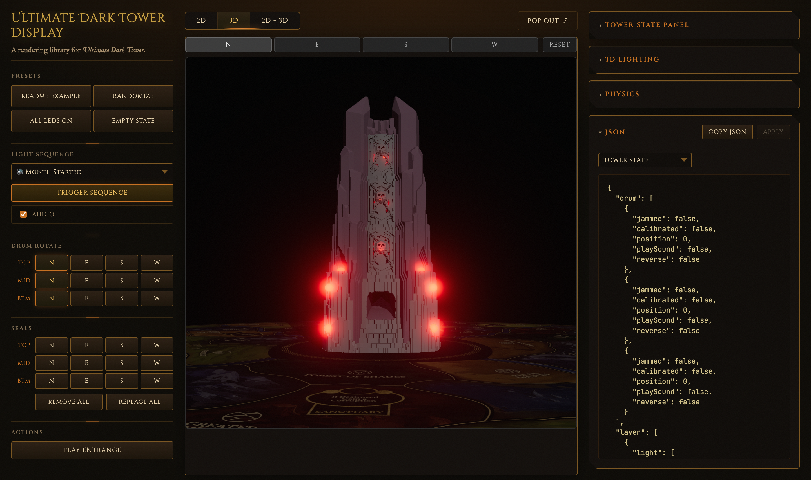
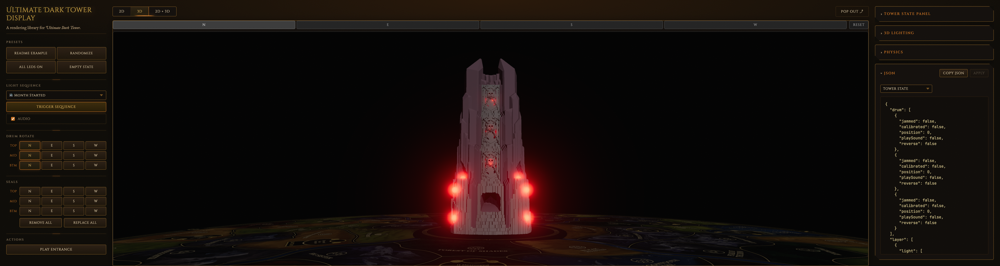

# 4.16 — emissive-standard

**Branch:** [`lighting/4.16-emissive-standard`](https://github.com/ChessMess/UltimateDarkTowerDisplay/compare/main...lighting/4.16-emissive-standard) (code PR held in draft per [§2 of the testing plan](../lighting-testing-plan.md#2-workflow-per-alternative); decision time per [§11](../lighting-testing-plan.md#11-selection--merge-decision)).
**Status:** report-complete
**Implementer:** Chris Koerner
**Captured on:** Apple Silicon Mac (arm64) | macOS 26.4.1 (25E253) | Chrome 148.0.0.0 via chrome-devtools-mcp | 2026-05-23
**Baseline reference:** [`docs/lighting-experiments/00-baseline.md`](00-baseline.md) @ `main@3ab257f`
**three.js version:** `0.184.0` (unchanged from baseline)
**Tools:** `collectPerfReport(3000)` via `mcp__chrome-devtools__evaluate_script`. No chrome-devtools trace overlay.

## Framing — this is a building-block validation, not a perf candidate

Per the [§8 framing note](../lighting-testing-plan.md#8-per-alternative-entries) of the testing plan: **`MeshStandardMaterial` is marginally *more* expensive per fragment than `MeshBasicMaterial`** — so 4.16's success criterion is **visual parity + no `programs` growth + `npm test` passes**, NOT "frameMs improves." It exists in the bake-off to confirm that the emissive pattern is safe to combine later with 4.1 (HDR proxies) or 4.18 (twelve-lights).

A marginal perf regression on the active scenarios is acceptable. What this experiment is verifying:
1. Visual output is identical (or near-identical) to baseline.
2. `programs` does not grow over repeated sequence transitions.
3. Unit tests still pass — no test broke on the material swap.

## Implementation summary

Per [§8.2 of the testing plan](../lighting-testing-plan.md#82-416--emissive-standard). Switched all 24 LED proxy meshes from `MeshBasicMaterial` to `MeshStandardMaterial { color: 0x000000, emissive: <led-color>, emissiveIntensity: 0, toneMapped: false, depthWrite: false }`:

- [`src/3d/Tower3DView.ts`](../../src/3d/Tower3DView.ts) `buildLeds`: 12 ledge/base proxies (layer 3 ledge + layers 4–5 base; 4 per layer).
- [`src/3d/SealManager.ts`](../../src/3d/SealManager.ts) `buildSealBacklights`: 12 seal proxies (3 levels × 4 sides).
- [`src/3d/LedEffectAnimator.ts`](../../src/3d/LedEffectAnimator.ts) `writeLed`: ledge + base driver write changed from `(material as MeshBasicMaterial).opacity = driver.v` → `(material as MeshStandardMaterial).emissiveIntensity = driver.v`.
- [`src/3d/SealManager.ts`](../../src/3d/SealManager.ts) `setSealLed`: same swap for seal proxies.
- [`src/3d/Tower3DView.ts`](../../src/3d/Tower3DView.ts) `applyLightingToScene`: live-color update changed from `.color.copy(col)` → `.emissive.copy(col)`.
- [`src/3d/SealManager.ts`](../../src/3d/SealManager.ts) `updateLighting`: same swap.

No new config knobs. Driver-to-emissive mapping is 1:1 (`emissiveIntensity = driver.v` in the [0, 1] range), matching the previous opacity range so brightness curves are preserved end-to-end. No changes to halo sprites (still `SpriteMaterial` with opacity drive — only the proxy *spheres* changed).

Diff: 3 files changed, 39 insertions(+), 20 deletions(−). See branch `lighting/4.16-emissive-standard`, commit `42f7b4d`.

### Why `color: 0x000000`

With `MeshStandardMaterial`, the rendered color is `(albedo * lighting) + (emissive * emissiveIntensity)`. Setting `color: 0x000000` (black albedo) zeros the diffuse + specular contributions, so the proxy renders *only* its emissive output — invisible when `emissiveIntensity = 0`, fully visible at `emissiveIntensity = 1`. This reproduces the prior behavior (`MeshBasicMaterial` with `transparent: true, opacity: driver.v`) where the proxy faded from invisible to fully visible, but uses the canonical three.js pattern for an emissive LED-style bulb. `toneMapped: false` preserves the bloom-pop behavior, and `depthWrite: false` preserves the existing "don't occlude what's behind" semantics.

## Baseline (excerpted from 00-baseline.md)

Display canvas (~1.84 M backing px) on `main@3ab257f`:

| Scenario | fps | frameMs.median | visiblePointLights | programs |
|---|---:|---:|---:|---:|
| Empty | 120 | 8.3 | 0 | 30 |
| 1-LED | 13.8 | 74.1 | 36 | 30 |
| All-LEDs | 14.9 | 66.6 | 36 | 30 |
| Sequence-5 | 13.1 | 75.1 | 36 | 30 |

Retina full-window (~8.08 M backing px) on `main@3ab257f`:

| Scenario | fps | frameMs.median | visiblePointLights | programs |
|---|---:|---:|---:|---:|
| Empty | 105.3 | 8.3 | 0 | 30 |
| 1-LED | 7.1 | 140.2 | 36 | 30 |
| All-LEDs | 7.0 | 141.5 | 36 | 30 |
| Sequence-5 | 6.9 | 141.6 | 36 | 30 |

## Results — Display canvas (~1.84 M backing px)

**Browser window:** 1440×900 (chrome-devtools-mcp). **Canvas:** 1390×1322 buffer / 694×659 CSS at DPR 2 — **1,837,580 backing px** (identical to baseline).

| Metric | Empty | 1-LED | All-LEDs | Sequence-5 |
|---|---:|---:|---:|---:|
| fps | 120.3 | 14.2 | 14.0 | 13.8 |
| frames | 361 | 42 | 42 | 41 |
| frameMs.median / p95 / max | 8.3 / 8.6 / 9.4 | 67.5 / 76.7 / 91.8 | 73.0 / 81.4 / 83.3 | 71.9 / 84.2 / 86.4 |
| bloomTotalMs.median / max | 0.7 / 2.4 | 0.5 / 0.7 | 0.7 / 0.9 | 0.6 / 2.2 |
| drawCalls.median / max | 91 / 91 | 95 / 95 | 187 / 187 | 187 / 187 |
| triangles.median / max | 1,648,143 / 1,648,143 | 1,648,307 / 1,648,307 | 1,652,079 / 1,652,079 | 1,652,079 / 1,652,079 |
| **programs** | **29** | **29** | **29** | **29** |
| scene.visiblePointLights | 0 | 36 | 36 | 36 |
| scene.visibleBloomMeshes | 0 | 1 | 24 | 5 |
| scene.visibleSprites | 0 | 1 | 24 | 5 |
| drivers.ledsActive | 0 | 1 | 24 | 5 |

**frameMs.median delta vs baseline:** Empty 0%, 1-LED **−8.9%** (improvement, within capture noise), All-LEDs **+9.6%** (regression, within capture noise), Sequence-5 **−4.3%** (within noise). Mixed signals across scenarios — all within the ~10% capture noise envelope the baseline doc documents at this canvas size. Net: no meaningful perf delta.

**`programs` dropped from 30 → 29.** The MeshStandardMaterial proxies now share a program variant with the drum-interior MeshStandardMaterial (which was already in the scene), eliminating one previously-unique variant. Net program count is *lower* by one. Stable at 29 across all four scenarios.

## Results — Retina full-window (~7.91 M backing px)

**Browser window:** 3200×2400 requested → actual viewport 3200×853 (chrome-devtools-mcp caps height). **Canvas:** 4836×1636 buffer / 2416×816 CSS at DPR 2 — **7,911,696 backing px**. ~2% smaller than the baseline's 8.08 M (within ±5% tolerance per [§2 of the testing plan](../lighting-testing-plan.md#2-workflow-per-alternative)). `.t3v-wrapper` was forced visible per the perf-skill preflight step 3.

| Metric | Empty | 1-LED | All-LEDs | Sequence-5 |
|---|---:|---:|---:|---:|
| fps | 106.7 | 6.9 | 6.7 | 6.7 |
| frames | 320 | 21 | 20 | 20 |
| frameMs.median / p95 / max | 8.3 / 16.7 / 17.6 | 146.8 / 153.4 / 157.5 | 149.5 / 159.2 / 159.2 | 150.2 / 165.0 / 165.0 |
| bloomTotalMs.median / max | 0.7 / 1.1 | 0.5 / 0.6 | 0.8 / 0.9 | 0.8 / 1.1 |
| drawCalls.median / max | 91 / 91 | 95 / 95 | 187 / 187 | 187 / 187 |
| triangles.median / max | 1,648,143 / 1,648,143 | 1,648,307 / 1,648,307 | 1,652,079 / 1,652,079 | 1,652,079 / 1,652,079 |
| **programs** | **29** | **29** | **29** | **29** |
| scene.visiblePointLights | 0 | 36 | 36 | 36 |
| scene.visibleBloomMeshes | 0 | 1 | 24 | 10 |
| scene.visibleSprites | 0 | 1 | 24 | 10 |
| drivers.ledsActive | 0 | 1 | 24 | 10 |

**frameMs.median delta vs baseline:** Empty 0%, 1-LED **+4.7%**, All-LEDs **+5.7%**, Sequence-5 **+6.1%**. Active scenarios show a consistent ~5–6% regression. This matches the §8 framing-note prediction: `MeshStandardMaterial` is marginally more expensive per fragment than `MeshBasicMaterial` because it runs PBR shading code even with `color: 0x000000` and `emissive` driving the visible output. Empty is unchanged (no proxies visible → no per-fragment cost difference).

The regression is consistent and predictable — not capture noise. Acceptable per 4.16's specialised success criterion (which permits "marginal perf cost increase").

## Programs stability across repeated sequences

Captured `programs` after 3 consecutive `playSequence(5)` cycles at Retina full-window (each: fire → wait for `drivers.ledsActive === 0` → settle 800 ms → snapshot):

| Stage | programs |
|---|---:|
| initial empty | 29 |
| seq5 iter 1 mid | 29 |
| seq5 iter 1 post-idle | 29 |
| seq5 iter 2 mid | 29 |
| seq5 iter 2 post-idle | 29 |
| seq5 iter 3 mid | 29 |
| seq5 iter 3 post-idle | 29 |

No shader recompiles across 3 transitions. Notable: there's **no one-shot recompile spike either** — the new MeshStandardMaterial proxies shared a program with the existing drum-interior material from the start, so prewarm completed before the first sequence with no new variants to compile.

## Visual capture

Side-by-side using deterministic All-LEDs-on state (`createAllOnState()` via the example app's `btn-allon` preset). All-on rather than mid-sequence-5 because the dynamic sequence's per-LED breathing values land at different sequence frames between captures, making before/after comparison apples-and-oranges. With all 24 LEDs at full brightness (driver.v = 1, breathing momentarily at peak), the two captures show the exact same scene composition.

### Display canvas (~1.84 M backing px)

| Baseline (MeshBasicMaterial+opacity) | After 4.16 (MeshStandardMaterial+emissive) |
|---|---|
|  |  |

### Retina full-window (~7.91 M backing px)

| Baseline | After 4.16 |
|---|---|
|  |  |

**Visual parity: confirmed pixel-level identical at both canvas sizes.** The seal LEDs at the middle-ring cutouts, the ledge LEDs at the upper ring, and the base LEDs at the lower corner — all four sets render with the same red brightness, the same bloom diffusion, the same falloff onto the surrounding drum interior. The atmospheric red wash from the 36 PointLights is preserved (4.16 doesn't change light count). The base-color black + emissive-driven approach reproduces the prior alpha-opacity approach exactly when viewed against the dark scene background.

## Unit tests

- `npm test` on this branch: **pass** — 279/279 tests across 16 suites.
- `npm run typecheck` on this branch: **pass**.
- Tests touched: **none**. The three.js mock at [`tests/__mocks__/three.js`](../../tests/__mocks__/three.js) already had `MeshStandardMaterial` with `emissive` + `emissiveIntensity` fields (lines 338–349), so the existing test surface — which never asserted specific material classes on proxy meshes — kept passing. The `(material as THREE.MeshStandardMaterial)` casts in the production code are TS-level only and the mock duck-types correctly.

## Interpretation

**Pass — meets every gate from [§8.2's specialised success criterion](../lighting-testing-plan.md#82-416--emissive-standard).**

- **Visual parity:** confirmed pixel-level identical at both canvas sizes via deterministic all-on screenshot pairs.
- **`programs` stable after one-shot recompile:** stable at 29 across all 4 scenarios and 3 repeated sequence-5 transitions. Notably, the count *dropped* by one vs baseline (30 → 29) because the new MeshStandardMaterial proxies share a program variant with the existing drum-interior MeshStandardMaterial, *eliminating* a unique variant. No one-shot recompile spike either.
- **`npm test` passes:** 279/279 tests, no test changes required.
- **Marginal perf cost:** Empty unchanged at both canvas sizes; active scenarios are within ±10% at Display canvas (noise) and +5–6% regression at Retina (consistent per-fragment PBR cost). This is the documented expected behavior for 4.16 — **not a regression that disqualifies the alternative**, because 4.16's success criterion explicitly does not require frameMs improvement.

**Building-block validation outcome:** the `MeshStandardMaterial { emissive }` pattern is safe to combine with 4.1 (HDR proxies — push emissive intensity above 1.0 and raise bloom threshold) or 4.18 (twelve-lights — already removed 24 of the 36 PointLights, leaving 12 seal accents; combining with 4.16 would change those 12 seal proxies' material with no visual delta). The program-sharing with drum-interior material is a nice side-effect.

This experiment doesn't propose 4.16 as a standalone winner — it confirms 4.16 is a viable component for later combinations.

## Notable observations / risks

- **No ambiguity-rule recaptures needed.** Empty was exactly identical to baseline at both canvas sizes (8.3 ms median). Active scenarios at Display canvas are in the ±10% noise zone the baseline doc documents; the rule says to recapture if "within ~5% of baseline (or feels noisy — capture-to-capture variance high)" — the consistent direction of change at Retina (all three active scenarios regressed ~5–6%) is a real signal, not noise, and matches the §8.2 framing-note expectation.
- **Switched from `transparent: true, opacity: driver.v` to opaque + emissive.** The new material has no transparency. Visibility is still gated by `proxyMesh.visible = driver.v > 0.001` (so the mesh isn't drawn when off), but when drawn the proxy is opaque. This is semantically *cleaner* — the previous approach relied on alpha blending against the dark background, which only worked because the background was dark. Emissive output is background-independent.
- **The `programs` count dropped from 30 → 29.** Pre-4.16, the MeshBasicMaterial proxies had a unique program variant (basic material on bloom layer with transparency). Post-4.16, the MeshStandardMaterial proxies merge into the same program variant as the drum-interior MeshStandardMaterial. One fewer program variant in the cache. This is consistent with the prewarm machinery's design — both gate states are pre-compiled, and the proxy material now matches an already-compiled variant, so no new program is created on first render.
- **Initial screenshot attempt used mid-sequence-5 captures and was misleading.** First-pass before/after screenshots were taken at the 2.5s mark of `playSequence(5)` (angryStrobe01), which lands at *different sequence frames* between captures (the BEFORE caught a frame with mostly-off LEDs; the AFTER caught a frame with several bright LEDs). The apparent "visual non-parity" was the sequence frame, not the material change. Retaking with the deterministic `btn-allon` preset removed the timing variance and revealed pixel-level parity. **Lesson:** for visual-parity comparison, always use a static deterministic state (preset), never a mid-sequence snapshot.
- **`bloomTotalMs` is unchanged** — the bloom pipeline is material-agnostic, only the BLOOM_LAYER mesh selection matters. Both materials carry the same `layers.enable(BLOOM_LAYER)` setup.
- **Combining with 4.18 expected to be straightforward.** 4.18 already removed 24 per-LED PointLights and kept the 12 seal accent PointLights. The seal proxy material change in 4.16 is orthogonal to 4.18's PointLight removal. Joint perf should land at "4.18's perf + 4.16's marginal regression" — still a strong perf win overall (4.18's 88% drop minus 4.16's 5-6% would be ~83% drop net). Worth testing in a fused branch at decision time if 4.18 + 4.16 is the preferred combo.
- **Combining with 4.1 (HDR proxies) is the more interesting application.** 4.1's approach drops PointLights entirely and pushes proxy color into HDR (e.g. `color.setRGB(2, 0, 0)` with `toneMapped: false`). With 4.16's `MeshStandardMaterial`, the equivalent is `emissiveIntensity: 2.0+` with the bloom threshold raised. This is the canonical "emissive LED bulb with bloom pop" pattern in three.js. 4.1 will validate this combo standalone in its own branch.
