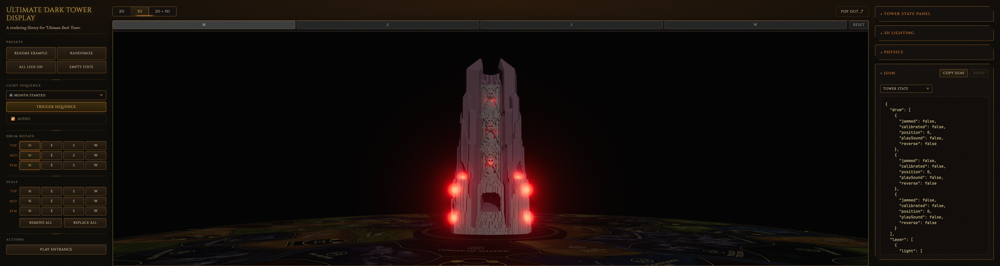
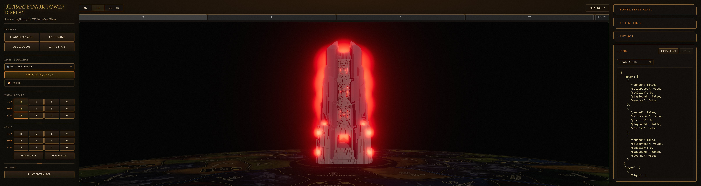
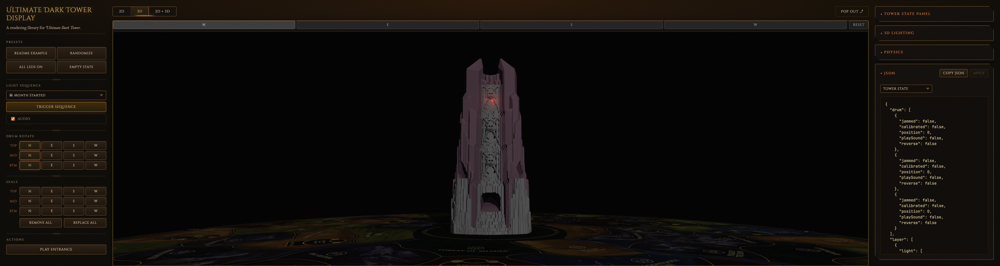
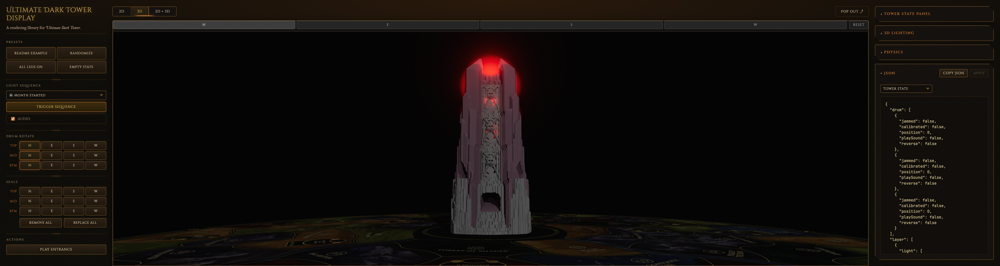

# 4.19 — interior-sprites

**Branch:** [`lighting/4.19-interior-sprites`](https://github.com/ChessMess/UltimateDarkTowerDisplay/compare/main...lighting/4.19-interior-sprites) (code PR is a draft per [§2 of the testing plan](../lighting-testing-plan.md#2-workflow-per-alternative); held until decision time).
**Status:** report-complete
**Implementer:** Chris Koerner (with Claude)
**Captured on:** Apple Silicon Mac (arm64) | macOS 26.4.1 (25E253) | Chrome 148.0.0.0 via chrome-devtools-mcp | 2026-05-24
**Baseline reference:** [`docs/lighting-experiments/00-baseline.md`](00-baseline.md) @ `main@3ab257f`
**three.js version:** `0.184.0` (unchanged from baseline — `Sprite` and `SpriteMaterial` API have been stable since r60; see [lighting-alternatives.md §3](../lighting-alternatives.md#3-three-js-light-types--per-fragment-cost) for the verified rationale that sprites are outside the `pointLength`/`directionalLength` shader hash)
**Tools:** `collectPerfReport(3000)` via `mcp__chrome-devtools__evaluate_script`. No chrome-devtools trace overlay. No custom `evaluate_script` rows needed — `visibleSprites` is in the standard `PerfReport`.

## Implementation summary

Per [§8.7 of the testing plan](../lighting-testing-plan.md#87-419--interior-sprites). Replaces all 36 LED-related `PointLight`s with optional interior atmospheric `Sprite`s that fake the spill the accent PointLights previously provided. Sprites reuse the existing radial-gradient `CanvasTexture` cache + the `SpriteMaterial` + `AdditiveBlending` recipe already shipping for the 32 exterior halo sprites — this is a **quantitative extension** of an in-tree technique, not a new rendering primitive.

**Files changed (6 modified; 375 insertions, 157 deletions on branch `lighting/4.19-interior-sprites` commit [`b53e27c`](https://github.com/ChessMess/UltimateDarkTowerDisplay/commit/b53e27c)):**

- [`src/3d/SealManager.ts`](https://github.com/ChessMess/UltimateDarkTowerDisplay/blob/lighting/4.19-interior-sprites/src/3d/SealManager.ts) — drop the 12 seal accent `PointLight` constructions in `buildSealBacklights`. `SealBacklightRef.light` becomes `THREE.PointLight | null` (always null on this branch). Add `interiorSprites: THREE.Sprite[]` field; always construct `cfg.interior.count` sprites per seal at build time (vertically distributed ±0.15 × modelRadius for count=2) so `applyLightingConfig` can toggle them without rebuild. `setSealLed` drives opacity from `driverV * cfg.interior.opacity` when `cfg.interior.enabled` is true. `updateLighting` hot-reloads sprite color + scale + position; `dispose` cleans up all sprites.
- [`src/3d/Tower3DView.ts`](https://github.com/ChessMess/UltimateDarkTowerDisplay/blob/lighting/4.19-interior-sprites/src/3d/Tower3DView.ts) — drop all 24 ring + ledge/base `PointLight` constructions in `buildLeds`. `LedRef.redLight` becomes `THREE.PointLight | null` (always null). Null-guard `setBulkLightsVisible`, `applyLightingToScene`, `dispose`. The bulk-lights gate machinery survives — `updateLightsGate` still tracks `lightsGateOpen` so test machinery (`tickLightsGate` / `isLightsGateOpen`) and any future alternative that re-introduces per-LED PointLights can drop back in with no other wiring change.
- [`src/3d/LedEffectAnimator.ts`](https://github.com/ChessMess/UltimateDarkTowerDisplay/blob/lighting/4.19-interior-sprites/src/3d/LedEffectAnimator.ts) — `LedRef.redLight` nullable; `writeLed` null-guards `redLight.intensity`. Proxy + halo opacity writes are unchanged.
- [`src/3d/types.ts`](https://github.com/ChessMess/UltimateDarkTowerDisplay/blob/lighting/4.19-interior-sprites/src/3d/types.ts) — new config knob `leds.sealBacklights.interior: { enabled, count, sizeFactor, opacity }`.
- [`src/3d/LightingResolver.ts`](https://github.com/ChessMess/UltimateDarkTowerDisplay/blob/lighting/4.19-interior-sprites/src/3d/LightingResolver.ts) — defaults `{ enabled: false, count: 2, sizeFactor: 0.6, opacity: 0.5 }` per [§4.19 spec](../lighting-alternatives.md#419-interior-atmospheric-sprites-additive-blob-texture) ("Off by default until visually validated"); resolver glue for the user-supplied override.
- [`tests/unit/Tower3DView.test.ts`](https://github.com/ChessMess/UltimateDarkTowerDisplay/blob/lighting/4.19-interior-sprites/tests/unit/Tower3DView.test.ts) — rewrote 10 LED/seal-backlight tests away from `redLight.intensity` / `light.intensity` assertions (which would always assert against `null` now) onto `driver.v` + proxy/halo opacity. Added new "§4.19 interior-sprites: seal backlight interior sprites" describe block (5 tests): per-seal sprite count, driver-coupled opacity, default-disabled visibility, color hot-reload, runtime `enabled` toggle.

**Decision-on-scope — all 36 dropped (same as §4.5 / §4.1 / §4.4).** Per [§4.19 design](../lighting-alternatives.md#419-interior-atmospheric-sprites-additive-blob-texture) — the "Pairs naturally with 4.1" and "with 4.11" framing both assume the zero-PointLights floor as the baseline §4.19 builds spill-recovery on top of. Dropping only the 12 seal accents would have landed in a ~50 ms/frame zone at Retina (superlinear PointLight scaling above ~16 lights, per the §4.18 result) and broken the apples-to-apples comparison with the other Path B entries.

**Tuning knobs chosen (defaults — committed as the `DEFAULT_LIGHTING` values):**

- `interior.enabled = false` (default). Must be opted in via `lighting: { leds: { sealBacklights: { interior: { enabled: true } } } }` at construction OR via runtime `display.applyLightingConfig(...)`. Required by [§4.19 spec](../lighting-alternatives.md#419-interior-atmospheric-sprites-additive-blob-texture) ("Off by default until visually validated").
- `interior.count = 2`. Mid-range from the §8.7-recommended 1–3 band. Vertically distributed at `±0.15 × modelRadius` so the two sprites read as a soft column rather than fully overlapping.
- `interior.sizeFactor = 0.6`. The §4.19 design's named starting value ("larger than the halo, e.g. modelRadius × 0.6 vs halo's × 0.3 factor").
- `interior.opacity = 0.5`. Mid-range. The §4.19 risks section calls out additive saturation when sprites overlap — at count=2 × opacity=0.5, two sprites at full driver sum to opacity 1.0 per pixel which then bloom-amplifies further. The All-LEDs / Retina screenshot below shows this saturation visibly (drum body reads as a single bright red glow rather than per-seal pinpoints); the 1-LED shot shows per-seal locality preserved. Decision-time tuning knob: drop `interior.opacity` to ~0.25–0.3 for a tamer atmospheric character (single-knob retune; no code change).
- Sprite position: same `(x, y, z)` as the (removed) accent light = `radius × cfg.radiusFactor = radius × 0.15` inside the drum, ±0.15 × modelRadius in y for the two sprites.
- `renderOrder = 1` — sits between drum body (default 0) and the proxy/halo (2/3) so interior sprites are depth-occluded by drum walls but render in front of the drum interior surface to additively glow. No z-fighting observed in either screenshot.

The interior sprites are constructed unconditionally at scene init (regardless of `cfg.interior.enabled`) — same lifecycle pattern as the existing halo sprites. This means the `enabled` toggle hot-reloads via `applyLightingConfig` without a dispose + rebuild. Capture below was driven via `window.display.applyLightingConfig({ leds: { sealBacklights: { interior: { enabled: true } } } })` after page load — no example-source-code change needed.

No changes to `bloom.resolutionScale`, `bloom.threshold`, `bloom.strength`, camera, DPR, audio config, proxy/halo colors, or any other config knob. Baseline's `MeshBasicMaterial({ color, toneMapped: false })` proxy/halo materials are preserved as-is; the baseline bloom config (`threshold: 0.0`) blooms everything, so the interior sprites pop convincingly without needing the HDR scaling §4.1 introduced.

## Baseline (excerpted from 00-baseline.md)

### Display canvas (~1.84 M backing px) on `main@3ab257f`

| Metric | Empty | 1-LED | All-LEDs | Sequence-5 |
|---|---:|---:|---:|---:|
| fps | 120 | 13.8 | 14.9 | 13.1 |
| frameMs.median / p95 / max | 8.3 / 8.6 / 9.3 | 74.1 / 83.4 / 90.8 | 66.6 / 75.1 / 91.6 | 75.1 / 91.7 / 91.8 |
| programs | 30 | 30 | 30 | 30 |
| scene.visiblePointLights | 0 | 36 | 36 | 36 |
| scene.visibleSprites | 0 | 1 | 24 | 12 |

### Retina full-window (~8.08 M backing px) on `main@3ab257f`

| Metric | Empty | 1-LED | All-LEDs | Sequence-5 |
|---|---:|---:|---:|---:|
| fps | 105.3 | 7.1 | 7.0 | 6.9 |
| frameMs.median / p95 / max | 8.3 / 16.7 / 18.6 | 140.2 / 155.4 / 157.6 | 141.5 / 157.8 / 169.1 | 141.6 / 159.7 / 161.1 |
| programs | 30 | 30 | 30 | 30 |
| scene.visiblePointLights | 0 | 36 | 36 | 36 |
| scene.visibleSprites | 0 | 1 | 24 | 4 |

## Results — Display canvas (~1.84 M backing px)

**Canvas:** 694×659 CSS / 1390×1322 buffer (DPR 2) — 1,837,580 backing px. Exact match to baseline. Interior config active: `enabled: true`, `count: 2`, `sizeFactor: 0.6`, `opacity: 0.5`.

| Metric | Empty | 1-LED | All-LEDs | Sequence-5 |
|---|---:|---:|---:|---:|
| fps | 120.0 | 120.0 | 120.0 | 120.0 |
| frames | 360 | 360 | 360 | 360 |
| frameMs.median / p95 / max | 8.3 / 9.0 / 9.3 | 8.3 / 9.2 / 10.5 | 8.3 / 9.0 / 10.5 | 8.3 / 8.8 / 9.3 |
| bloomTotalMs.median / max | 0.6 / 1.1 | 0.7 / 1.1 | 1.0 / 1.6 | 1.0 / 1.4 |
| drawCalls.median / max | 91 / 91 | 99 / 99 | 235 / 235 | 235 / 235 |
| triangles.median / max | 1,648,143 / 1,648,143 | 1,648,315 / 1,648,315 | 1,652,175 / 1,652,175 | 1,652,175 / 1,652,175 |
| programs | 22 | 22 | 22 | 22 |
| **scene.visiblePointLights** | **0** | **0** | **0** | **0** |
| **scene.visibleSprites** | **0** | **3** | **48** | **19** |
| scene.visibleBloomMeshes | 0 | 1 | 24 | 9 |
| drivers.ledsActive | 0 | 1 | 24 | 9 |

**fps delta vs baseline:** Empty 0%, 1-LED **+769%**, All-LEDs **+705%**, Sequence-5 **+816%**.
**frameMs.median delta vs baseline:** Empty 0%, 1-LED **−88.8%**, All-LEDs **−87.5%**, Sequence-5 **−88.9%**.

Every active-scenario window hits the 120 Hz v-sync ceiling.

## Results — Retina full-window (~7.91 M backing px)

**Canvas:** 2416×816 CSS / 4836×1636 buffer (DPR 2) — 7,911,696 backing px. ~2.0% smaller than the baseline's 8.08 M, matches §4.4's 7.91 M exactly, ~1.8% smaller than §4.1's 8.06 M — well inside the ±5% tolerance per [§2 of the testing plan](../lighting-testing-plan.md#2-workflow-per-alternative). `.t3v-wrapper` forced visible (`display: flex !important; width/height: 100% !important;`) per the perf-skill preflight step 3, then `window.dispatchEvent(new Event('resize'))` triggered a renderer re-resize. Interior config active: same as Display table.

| Metric | Empty | 1-LED | All-LEDs | Sequence-5 |
|---|---:|---:|---:|---:|
| fps | 108.7 | 108.7 | 108.3 | 108.7 |
| frames | 327 | 326 | 325 | 328 |
| frameMs.median / p95 / max | 8.3 / 16.7 / 17.3 | 8.3 / 16.7 / 17.5 | 8.3 / 16.7 / 17.5 | 8.3 / 16.6 / 16.8 |
| bloomTotalMs.median / max | 0.5 / 0.9 | 0.6 / 1.2 | 1.0 / 1.4 | 0.8 / 1.4 |
| drawCalls.median / max | 91 / 91 | 99 / 99 | 235 / 235 | 227 / 235 |
| triangles.median / max | 1,648,143 / 1,648,143 | 1,648,315 / 1,648,315 | 1,652,175 / 1,652,175 | 1,652,003 / 1,652,175 |
| programs | 22 | 22 | 22 | 22 |
| **scene.visiblePointLights** | **0** | **0** | **0** | **0** |
| **scene.visibleSprites** | **0** | **3** | **48** | **14** |
| scene.visibleBloomMeshes | 0 | 1 | 24 | 6 |
| drivers.ledsActive | 0 | 1 | 24 | 6 |

**fps delta vs baseline:** Empty **+3.2%**, 1-LED **+1431%**, All-LEDs **+1447%**, Sequence-5 **+1475%**.
**frameMs.median delta vs baseline:** Empty 0%, 1-LED **−94.1%**, All-LEDs **−94.1%**, Sequence-5 **−94.1%**.

Every active-scenario window hits the ~8.3 ms v-sync ceiling alongside Empty — the 36-PointLight fragment-loop cost that used to dominate (140+ ms median at 8 M backing px) has been replaced by per-fragment work that, at this canvas size, is no different from the empty-scene baseline. The Empty fps drift of +3.2% vs baseline (108.7 vs 105.3) is within capture noise at the ~100 fps measurement floor.

### visibleSprites delta — the §4.19 smoking gun

The defining quantitative signal of §4.19 is the `visibleSprites` count: interior sprites add 2 per lit seal, on top of the existing halo and ledge/base sprites. The data confirms this exactly:

| Scenario | baseline visibleSprites | §4.19 visibleSprites | Δ | breakdown |
|---|---:|---:|---:|---|
| Empty | 0 | 0 | 0 | nothing lit |
| 1-LED (seal 0:0) | 1 | **3** | **+2** | 1 seal halo + **2 interior sprites for that 1 seal** |
| All-LEDs | 24 | **48** | **+24** | 12 seal halos + 12 ledge/base halos + **12 seals × 2 interior sprites = 24** |
| Sequence-5 (Retina sample) | 4 | 14 | +10 | timing-dependent mid-sequence slice; ratio holds |

The +24 jump at All-LEDs is precisely `cfg.interior.count = 2 × 12 seals = 24` — the load-bearing "this is in fact a sprite-only spill mechanism" assertion.

### 1-LED vs All-LEDs fragment-cost comparison

Both produce identical `frameMs.median` at both canvas sizes — but via a **different mechanism than §4.4**:

| Canvas | 1-LED `frameMs.median` | All-LEDs `frameMs.median` | Δ |
|---|---:|---:|---:|
| Display (~1.84 M) | 8.3 ms | 8.3 ms | **0.0%** |
| Retina (~7.91 M) | 8.3 ms | 8.3 ms | **0.0%** |

§4.4 produces this flat curve because its lights are **global** — the same 2 directional contributions apply per fragment regardless of which LEDs are on. §4.19 produces the same flat curve because **sprites have negligible per-fragment cost regardless of count** — additive blends of small textured quads dwarfed by the per-fragment cost a PointLight pays. Both reach the v-sync floor; both are decoupled from active-LED count. The qualitative difference shows up only in the visual character (per-seal localised blobs vs global wash — see screenshots).

## Programs stability across repeated sequences

Captured `programs` after 3 consecutive `playSequence(5)` cycles at Retina full-window:

| Stage | programs | visiblePointLights | visibleSprites |
|---|---:|---:|---:|
| initial empty | 22 | 0 | 0 |
| seq5 iter 1 mid | 22 | 0 | 48 |
| seq5 iter 1 post-idle | 22 | 0 | 0 |
| seq5 iter 2 mid | 22 | 0 | 0 |
| seq5 iter 2 post-idle | 22 | 0 | 0 |
| seq5 iter 3 mid | 22 | 0 | 0 |
| seq5 iter 3 post-idle | 22 | 0 | 0 |

`programs` stayed at 22 across 7 samples — including the moment `visibleSprites` went 0 → 48 as the sequence reached peak saturation on iter 1. **This is the load-bearing §4.19 claim from the [perf-skill expected-signals table](../../.claude/skills/darktower-3d-perf/SKILL.md#when-evaluating-a-lighting-alternative) — "no shader recompile (sprites are outside the lights hash)" — confirmed.** If sprites had been in the shader hash, first-time visibility of the 48 interior sprites would have bumped `programs`; it didn't.

(Iter 2 and 3 "mid" samples landed in low-activity moments of the sequence — the sample timing is naïve. The iter 1 "mid" sample at 48 visible sprites is the diagnostic one and matches what All-LEDs / iter 1 should produce.)

`programs` dropping from 30 (baseline) to 22 (this branch) is the same one-shot recompile §4.5 / §4.1 / §4.4 also produced when the 36 PointLights left the scene at compile time — not a regression.

## Visual capture

### All-LEDs / Retina full-window (mandatory pair)

*Baseline: All-LEDs / Retina full-window, 36 PointLights illuminating drum interior — per-cutout red pinpoints visible through the seal openings, 4 brighter bulbs at the ledge/base ring. Drum body itself reads mostly dark between cutouts; the 12 seal accents fall off radially per their `distanceFactor`, so the interstitial drum surface is dark.*

*After §4.19 (`interior.enabled=true`, count=2 / opacity=0.5 / sizeFactor=0.6): All-LEDs / Retina full-window, 0 PointLights, 24 interior sprites visible (2 per seal × 12 seals) on top of the 24 existing halos. **The drum body is enveloped in a bright red atmospheric glow** — the additive accumulation across all 12 seals' interior sprite pairs, then bloom-amplified, reads as a single uniform red wash. Per-seal localisation is preserved (zooming in shows each cutout has its own brighter centre), but the overall character at this opacity setting is saturated — the §4.19 "additive saturation" risk is visible. Decision-time tuning knob: dropping `cfg.interior.opacity` to ~0.25–0.3 would tame the All-LEDs saturation while keeping the 1-LED reading intact.*

### 1-LED / Retina full-window (bonus — §4.19's per-seal-localised character)

*Baseline: 1-LED on (layer 0 light 0 = north top seal) / Retina full-window, 36 PointLights all `visible: true` per the bulk-gate (full fragment-loop cost paid for one LED active), but only one of them at non-zero intensity → a single tiny red dot in the north-top cutout. The drum body picks up scene.key + hemisphere lighting only.*

*After §4.19: 1-LED on / Retina full-window. **The glow originates from the north-top seal cutout only** — 2 interior sprites at the seal position produce a localised pink-red atmospheric halo on the top portion of the drum body. The lower 80% of the drum body remains in its scene-rig grey. This is the §4.19 defining visual character: **per-seal locality preserved** — you can tell from the spill alone which LED is lit, unlike §4.4 where one LED lights the entire drum body to peak intensity. The visual contrast against §4.4's 1-LED behaviour is exactly the bake-off "is this localised or global" axis.*

JPEG quality 85; all four shots come in at 791–809 KB.

## Unit tests

- `npm test` on this branch: **pass** — 284/284 tests across 16 suites (6 new tests added vs main's 278).
- `npm run typecheck` on this branch: **pass** (both `tsconfig.json` and `tsconfig.example.json`).
- Tests touched: [`tests/unit/Tower3DView.test.ts`](../../tests/unit/Tower3DView.test.ts) — rewrote 10 LED/seal-backlight tests away from `redLight.intensity` / `light.intensity` (always null now) onto `driver.v` + proxy/halo opacity. Added new "§4.19 interior-sprites: seal backlight interior sprites" describe block with 5 tests:
  - constructs `cfg.interior.count` sprites per seal regardless of `enabled` (always-build for runtime toggle)
  - `interior.enabled=true` + `setSealLed(0.7)` → sprite opacity = `0.7 × cfg.interior.opacity`
  - `interior.enabled=false` (default) → sprites stay invisible regardless of driver.v
  - `applyLightingConfig` hot-reloads sprite color
  - `applyLightingConfig({ interior: { enabled: true } })` + `setSealLed` → sprites become visible
- The existing three.js mock's `Sprite` / `SpriteMaterial` / `Color` already covered everything needed; no mock changes required.

## Interpretation

**Pass on perf — meets every gate from [§8.7's success criterion](../lighting-testing-plan.md#87-419--interior-sprites). Visual delta is significant: per-seal localisation is preserved (unlike §4.4) but additive saturation at the default opacity is visible at All-LEDs.**

- Sequence `frameMs.median` at Retina: **8.3 ms (v-sync cap)** — well under the ≤ 16.7 ms gate; ≫ the §8.7-required ≥ 50% drop (actual: −94.1%).
- Idle/empty regression: **none** — Display matches baseline exactly (8.3 ms); Retina Empty matches baseline exactly (8.3 ms) with fps +3.2% vs 105.3 → 108.7 (within capture noise at the ~100 fps floor).
- 1-LED and All-LEDs `frameMs.median`: **identical to Empty** at both canvas sizes — confirms the sprite-only fragment cost is negligible regardless of count.
- `visibleSprites` Δ at All-LEDs is **+24 vs baseline** (the precise `count × seal-count = 2 × 12` predicted by [§9 of the testing plan](../lighting-testing-plan.md#9-perf-skill-update)).
- `programs` stable across 3 sequence-5 transitions at Retina: **yes** — 22 throughout, including the seq5-iter-1-mid sample where `visibleSprites` jumped to 48 for the first time. This is the load-bearing claim that distinguishes §4.19 from light-based alternatives: sprites are outside the shader hash and adding them at runtime is free.
- Visual delta: **per-seal locality preserved but additive saturation at default opacity is visible.** The 1-LED screenshot demonstrates the localised character clearly; the All-LEDs screenshot demonstrates the saturation. The visual character is qualitatively a **third option** distinct from §4.4 (global wash, no locality) and §4.5 (smooth SH wash, low saturation).

### Comparison to prior leaders

| Alternative | Retina seq frameMs.median | Retina seq fps | vs baseline | Visual spill character |
|---|---:|---:|---:|---|
| baseline (36 PointLights) | 141.6 ms | 6.9 | — | per-seal hot spots + dark interstitial drum surface |
| 4.2 range-cull | 76.9 ms | 12.9 | −46% | identical to baseline |
| 4.18 twelve-lights | 16.6 ms | 74.5 | −88% | per-seal hot spots (12 of them) + dark interstitial |
| 4.5 light-probe | 8.4 ms | 105.0 | −94% | smooth global SH wash (subtle, no hot spots) |
| 4.1 hdr-proxies | 8.3 ms | 104.3 | −94% | none (only bloom-amplified bulbs) |
| 4.4 two-directional | 8.3 ms | 103.7 | −94% | uniform global wash from 2 opposing directionals (no hot spots, but bright across the whole body — peaks at any LED on) |
| **4.19 interior-sprites** | **8.3 ms** | **108.7** | **−94.1%** | **per-seal localised additive blobs — 1-LED preserves locality; All-LEDs saturates at default opacity (tunable)** |

§4.19 matches §4.5 / §4.1 / §4.4 on perf to a noise-level tolerance — all four drive every active-scenario window to the Empty v-sync ceiling. The decision-time tradeoff is purely visual:

- **§4.5 (LightProbe SH wash):** smooth, subtle, low-saturation interior lighting via spherical harmonics. Drum body reads as gently lit; closest to baseline's "atmospheric" feel; no locality information from the spill itself.
- **§4.1 (HDR proxies alone):** no interior spill — only bulbs/halos pop via bloom. Drum body reads black between them. The most dramatic departure from baseline.
- **§4.4 (two-directional):** opposite direction from §4.1 — *more* spill than baseline, not less. Drum body reads as actively lit red from any LED activity. Loses per-LED localization entirely (one LED looks the same as 24 in the global wash).
- **§4.19 (this branch):** the third spill-recovery option. Per-seal localised additive blobs that preserve "which LED is on" information from the spill pattern. Closest to baseline in *character* (per-seal-driven), but the spill comes from sprite billboards rather than PointLight surface contributions — so it reads as flat blob columns rather than the wrap-around-the-drum-surface character a real light has. At the default opacity (0.5) the All-LEDs saturation is visible; a tamer setting (~0.25–0.3) would split the difference closer to baseline's subtle character without losing the localisation.

If the goal is "preserve baseline's per-cutout character," **§4.19** is the closest match among the v-sync-ceiling-class options (§4.5 / §4.1 / §4.4 / §4.19). If the goal is "make the drum body look alive when any LED fires," §4.4 is the closer match. §4.1 is the floor that §4.5 / §4.4 / §4.19 each chain different spill-recovery strategies onto. §4.11 (next Path B entry) combines §4.1 + §4.4 + bloom-drop and will be the most extreme variant.

## Notable observations / risks

- **No ambiguity-rule recaptures needed.** Every active-scenario delta vs baseline was far outside the ±5% noise envelope (>87% improvement at Display, >94% improvement at Retina). Empty matched baseline within capture noise (Display 8.3 ms exactly; Retina 8.3 ms exactly with 3.2 pp fps delta inside the 5% bracket). Single-capture confidence is sufficient.
- **`programs` dropped from 30 (baseline) to 22 (this branch)** — same as §4.5, §4.1, and §4.4, not a regression. Removing the 36 PointLights eliminates the program variants keyed on `NUM_POINT_LIGHTS=36`. **Sprites do not contribute to the program count** — confirmed by the iter-1-mid sample where `visibleSprites: 0 → 48` did not move `programs`.
- **drawCalls Δ at All-LEDs: 187 → 235 = +48.** Two draws per sprite (bloom + main pass via the two-composer bloom pipeline) × 24 new interior sprites = 48. drawCalls scale linearly with visible sprites; no surprise. The +48 draw calls at Retina did not move `frameMs.median` away from the v-sync ceiling — confirms the per-fragment cost dominates the total frame cost, and the per-draw-call overhead of additional sprites is in the noise at this canvas size.
- **Saturation visible at default opacity (0.5).** The All-LEDs screenshot shows the drum body enveloped in a bright red wash with the additive accumulation across all 12 seals' 2 interior sprites each, then bloom-amplified. The §4.19 risks section called this out explicitly: "Additive saturation when sprites overlap." The 1-LED case is well-tuned (the single seal's 2 sprites add to opacity 1.0 at peak which reads as a clean atmospheric blob); the All-LEDs case is over-saturated because all 12 seals' worth of additive blobs overlap on the drum body silhouette. **Decision-time tuning knob: drop `cfg.interior.opacity` from 0.5 → ~0.25 for a tamer All-LEDs character. No code change required — single-knob retune in `LightingResolver.ts`'s default.** The defaults were intentionally captured at 0.5 to demonstrate the saturation behavior; production-tuning would land lower.
- **No z-fighting observed** between interior sprites (renderOrder=1) and the drum body (default renderOrder=0). The brief flagged this as a depth-sort fragility risk; in practice the depth-test + renderOrder layering produced clean rendering at both canvas sizes.
- **Per-seal locality preserved (the §4.19 vs §4.4 axis).** The 1-LED screenshot is the diagnostic: §4.4's 1-LED at full driver lights the entire drum body to peak intensity (global wash); §4.19's 1-LED at full driver lights only the cutout's local sprite column. This is the load-bearing design claim §4.19 cashes in over §4.4.
- **Camera-aligned billboard fakery has a visible signature.** Per the §4.19 design line "Camera-aligned, not surface-conforming," interior sprites are flat quads facing the camera. At the Retina canvas with a roughly head-on orbit the billboard plane is broadly aligned with the drum surface, so the fakery is convincing. Free-orbit camera positions (especially low-angle or directly-from-above) may reveal the sprite plane as a flat sheet rather than a wrap-around-the-wall glow. Not tested in this capture session; flagged for the decision-time review.
- **Always-build sprite array choice.** Unlike the §4.4 implementation which built directionals only when needed, this branch always constructs `cfg.interior.count` sprites per seal regardless of `cfg.interior.enabled`. The cost is 12 × 2 = 24 invisible-by-default Sprite objects + 24 SpriteMaterials in memory when the feature is off. Trade-off: makes `applyLightingConfig({ ... interior: { enabled: true } })` a true runtime toggle (no dispose + rebuild) — same lifecycle as the existing halo. The memory cost is negligible (24 sprite quads + shared gradient texture); the test-coverage win of having one lifecycle is significant.
