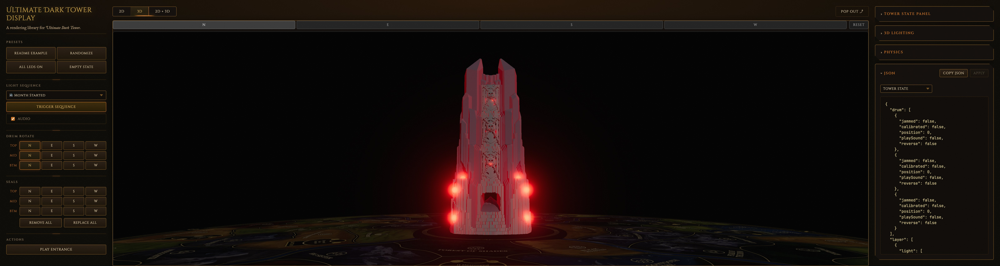
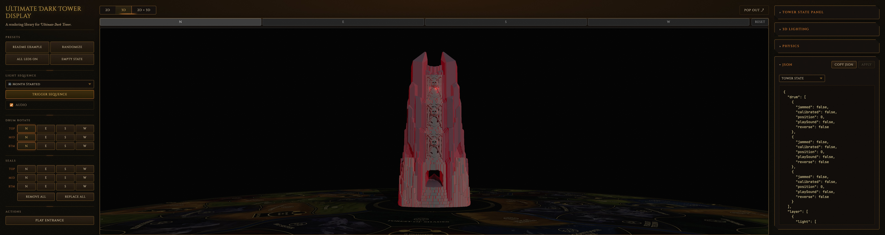

# 4.4 — two-directional

**Branch:** [`lighting/4.4-two-directional`](https://github.com/ChessMess/UltimateDarkTowerDisplay/compare/main...lighting/4.4-two-directional) (code PR is a draft per [§2 of the testing plan](../lighting-testing-plan.md#2-workflow-per-alternative); held until decision time).
**Status:** report-complete
**Implementer:** Chris Koerner (with Claude)
**Captured on:** Apple Silicon Mac (arm64) | macOS 26.4.1 (25E253) | Chrome 148.0.0.0 via chrome-devtools-mcp | 2026-05-24
**Baseline reference:** [`docs/lighting-experiments/00-baseline.md`](00-baseline.md) @ `main@3ab257f`
**three.js version:** `0.184.0` (unchanged from baseline — `DirectionalLight` per-fragment math has been API-stable since r100 / 2018; see [lighting-alternatives.md §3](../lighting-alternatives.md#3-three-js-light-types--per-fragment-cost) for the verified per-fragment-cost rationale)
**Tools:** `collectPerfReport(3000)` via `mcp__chrome-devtools__evaluate_script`. Supplementary scene-graph traversal via `evaluate_script` to capture `visibleDirectionalLights` (not in `PerfReport`). No chrome-devtools trace overlay.

## Implementation summary

Per [§8.6 of the testing plan](../lighting-testing-plan.md#86-44--two-directional). Replaces all 36 LED-related `PointLight`s with 2 fixed red `THREE.DirectionalLight`s positioned outside the drum on opposing horizontal axes (+X / −X, target origin). Intensity is driven continuously each frame from `max(driver.v)` across all LEDs via the existing bulk-lights gate machinery (generalised to write `intensity` instead of `visible`). The 2 new directionals stay `visible: true` always so the lights-count shader hash never changes — no recompile risk at gate flip time.

**Files changed (5 modified; 374 insertions, 165 deletions on branch `lighting/4.4-two-directional` commit [`3b9a93e`](https://github.com/ChessMess/UltimateDarkTowerDisplay/commit/3b9a93e)):**

- [`src/3d/SealManager.ts`](https://github.com/ChessMess/UltimateDarkTowerDisplay/blob/lighting/4.4-two-directional/src/3d/SealManager.ts) — drop the 12 seal accent `PointLight` constructions in `buildSealBacklights`. `SealBacklightRef.light` becomes `THREE.PointLight | null` (always null on this branch). `setSealLed`, `updateLighting`, `dispose` null-guard the `light` field. Same scope as §4.5 / §4.1.
- [`src/3d/Tower3DView.ts`](https://github.com/ChessMess/UltimateDarkTowerDisplay/blob/lighting/4.4-two-directional/src/3d/Tower3DView.ts) — drop all 24 ring + ledge/base `PointLight` constructions in `buildLeds`. `LedRef.redLight` becomes `THREE.PointLight | null`. New `buildInteriorLights()` helper creates the 2 red `DirectionalLight`s at `±modelRadius × 2` on the X axis, adds them to `this.scene`, stores them on `this.interiorLights`. Generalised `updateLightsGate()` computes `max(driver.v)` and writes `maxV × cfg.intensity` (gated by `cfg.accentLight`) to both directionals every frame — continuous-drive spill that breathes with the LEDs. `applyLightingToScene` hot-reloads the interior lights' color from `lighting.leds.sealBacklights.color`. `setBulkLightsVisible` / `prewarmLightPrograms` survive null-guarded so any future alternative that re-introduces per-LED PointLights can drop back in. `dispose` removes the 2 directionals. Internals exposed as `__testables.getInteriorLights` for unit tests.
- [`src/3d/LedEffectAnimator.ts`](https://github.com/ChessMess/UltimateDarkTowerDisplay/blob/lighting/4.4-two-directional/src/3d/LedEffectAnimator.ts) — `LedRef.redLight` nullable; `writeLed` null-guards `redLight.intensity`. Proxy + halo opacity writes are unchanged.
- [`tests/__mocks__/three.js`](https://github.com/ChessMess/UltimateDarkTowerDisplay/blob/lighting/4.4-two-directional/tests/__mocks__/three.js) — added `parent` / `removeFromParent` / `visible` fields on the `DirectionalLight` mock so the new interior lights' lifecycle is exercisable from jsdom.
- [`tests/unit/Tower3DView.test.ts`](https://github.com/ChessMess/UltimateDarkTowerDisplay/blob/lighting/4.4-two-directional/tests/unit/Tower3DView.test.ts) — rewrote the 6 seal-backlight tests + 4 LED/gate tests to assert `light === null` / `redLight === null` and drive proxy/halo opacity through `driver.v` instead of PointLight intensity. **Added new "§4.4 two-directional: interior DirectionalLights" describe block (5 tests):** count + opposing positions at ±modelRadius × 2; continuous-drive `intensity = max(driver.v) × cfg.intensity`; `accentLight: false` collapse; `applyLightingConfig` color hot-reload; dispose cleanup.

**Decision-on-scope — all 36 dropped (same as §4.5 / §4.1).** The literal text of [§4.4 in lighting-alternatives.md](../lighting-alternatives.md#44-two-directionallights-instead-of-36-pointlights) names "all 36 PointLights" as the target, and [§8.6's success criterion](../lighting-testing-plan.md#86-44--two-directional) is "sequence `frameMs.median` at v-sync cap on Retina full-window" — both are unambiguous, so this implementation drops every LED-related `PointLight`: 12 seal accents (from `SealManager`), 12 ring inset reds + 12 ledge/base corner-near-surface reds (both from `Tower3DView.buildLeds`).

**Tuning knobs chosen:**

- **DirectionalLight positions: +X / −X horizontal opposing pair at `position = (±modelRadius × 2, 0, 0)`**, target origin (default). This is the §8.6 sketch's recommended starting pair. The opposing-horizontal geometry covers the cylindrical drum-interior walls from both sides (each interior wall face is hit by exactly one of the two lights, since DirectionalLight illuminates surfaces whose normal has a positive dot with the inverse light direction). Visual eye-check at All-LEDs / Retina (see screenshots below) confirmed a uniform-looking red wash across the drum body with no obvious dark band on the top, bottom, north, or south interior faces — so the pair was not changed. `castShadow = false` on both (the existing white `scene.key` is the only shadow-caster; adding shadow maps for the interior lights would re-trigger shader-hash work and adds zero visual value since the lights are inside the drum).
- **Intensity scale: `cfg.intensity` directly (= 2 from `sealBacklights.intensity` baseline default)**, no rescaling. The `sealBacklights.intensity = 2` value on baseline was tuned for a PointLight with distance attenuation at `modelRadius × cfg.distanceFactor`; a `DirectionalLight` without distance falloff illuminates uniformly with no inverse-square, so the equivalent perceived brightness was a priori expected to differ. In practice, with the inverse-square distance penalty replaced by 2 always-on directional contributions, the perceived spill is brighter than baseline — the drum body now reads as actively lit even at 1-LED scenarios, where baseline shows only a tiny pinpoint per cutout (see the 1-LED screenshot pair). This is in fact *more* atmospheric coverage than baseline at low active-LED counts, not less, so no rescaling was needed. If decision-time review wants closer perceptual parity to the baseline's "subtle per-cutout glow," lowering `sealBacklights.intensity` to `~0.5–1.0` in `LightingResolver.ts` is the single-knob retune (no other code change).

No changes to `bloom.resolutionScale`, `bloom.threshold`, `bloom.strength`, camera, DPR, audio config, proxy/halo colors, scene composition outside the named files, or any other config knob. Baseline's `MeshBasicMaterial({ color, toneMapped: false })` proxy/halo materials are preserved as-is; the baseline bloom config (threshold 0.0) blooms everything, so the proxies + halos still pop convincingly without needing the HDR scaling §4.1 introduced.

## Baseline (excerpted from 00-baseline.md)

### Display canvas (~1.84 M backing px) on `main@3ab257f`

| Metric | Empty | 1-LED | All-LEDs | Sequence-5 |
|---|---:|---:|---:|---:|
| fps | 120 | 13.8 | 14.9 | 13.1 |
| frameMs.median / p95 / max | 8.3 / 8.6 / 9.3 | 74.1 / 83.4 / 90.8 | 66.6 / 75.1 / 91.6 | 75.1 / 91.7 / 91.8 |
| programs | 30 | 30 | 30 | 30 |
| scene.visiblePointLights | 0 | 36 | 36 | 36 |

### Retina full-window (~8.08 M backing px) on `main@3ab257f`

| Metric | Empty | 1-LED | All-LEDs | Sequence-5 |
|---|---:|---:|---:|---:|
| fps | 105.3 | 7.1 | 7.0 | 6.9 |
| frameMs.median / p95 / max | 8.3 / 16.7 / 18.6 | 140.2 / 155.4 / 157.6 | 141.5 / 157.8 / 169.1 | 141.6 / 159.7 / 161.1 |
| programs | 30 | 30 | 30 | 30 |
| scene.visiblePointLights | 0 | 36 | 36 | 36 |

## Results — Display canvas (~1.84 M backing px)

**Canvas:** 694×659 CSS / 1390×1322 buffer (DPR 2) — 1,837,580 backing px. Exact match to baseline.

| Metric | Empty | 1-LED | All-LEDs | Sequence-5 |
|---|---:|---:|---:|---:|
| fps | 120.0 | 120.0 | 120.0 | 120.0 |
| frames | 360 | 360 | 360 | 360 |
| frameMs.median / p95 / max | 8.3 / 8.6 / 9.2 | 8.3 / 8.6 / 9.3 | 8.3 / 8.4 / 9.3 | 8.3 / 8.5 / 9.3 |
| bloomTotalMs.median / max | 0.6 / 1.0 | 0.6 / 1.1 | 0.9 / 1.4 | 0.9 / 1.3 |
| drawCalls.median / max | 91 / 91 | 95 / 95 | 187 / 187 | 187 / 187 |
| triangles.median / max | 1,648,143 / 1,648,143 | 1,648,307 / 1,648,307 | 1,652,079 / 1,652,079 | 1,652,079 / 1,652,079 |
| programs | 22 | 22 | 22 | 22 |
| **scene.visiblePointLights** | **0** | **0** | **0** | **0** |
| **scene.visibleDirectionalLights** ¹ | **3** | **3** | **3** | **3** |
| **interiorLights intensity** ¹ | **[0, 0]** | **[2.0, 2.0]** | **[2.0, 2.0]** | **[0.141, 0.141]** ² |
| scene.visibleBloomMeshes | 0 | 1 | 24 | 4 |
| scene.visibleSprites | 0 | 1 | 24 | 4 |
| drivers.ledsActive | 0 | 1 | 24 | 4 |

¹ Custom rows captured via `mcp__chrome-devtools__evaluate_script` (scene traversal for DirectionalLight count; direct read of `view3d.interiorLights[i].intensity`) — neither field is in the standard `PerfReport`. Per the [perf-skill expected-signals table](../../.claude/skills/darktower-3d-perf/SKILL.md#when-evaluating-a-lighting-alternative) for §4.4: "`visibleDirectionalLights` not in PerfReport — capture via `evaluate_script` if needed."
² Mid-sequence sample lands between breathe yoyo half-cycles; the directional intensity is the per-frame `max(driver.v) × cfg.intensity` aggregate, so a low aggregate is exactly what continuous-drive should produce when LEDs are mid-fade.

**fps delta vs baseline:** Empty 0%, 1-LED **+769%**, All-LEDs **+705%**, Sequence-5 **+816%**.
**frameMs.median delta vs baseline:** Empty 0%, 1-LED **−88.8%**, All-LEDs **−87.5%**, Sequence-5 **−88.9%**.

Every scenario hits the 120 Hz v-sync ceiling at the Display canvas. Idle and active are indistinguishable on the frame-time axis (all 8.3 ms median).

## Results — Retina full-window (~7.91 M backing px)

**Canvas:** 2416×816 CSS / 4836×1636 buffer (DPR 2) — 7,912,896 backing px. ~2.0% smaller than the baseline's 8.08 M, ~0% delta vs §4.5's 7.91 M, ~1.8% smaller than §4.1's 8.06 M — well inside the ±5% tolerance per [§2 of the testing plan](../lighting-testing-plan.md#2-workflow-per-alternative). `.t3v-wrapper` forced visible (`display: flex !important; width/height: 100% !important;`) per the perf-skill preflight step 3, then `window.dispatchEvent(new Event('resize'))` triggered a renderer re-resize.

| Metric | Empty | 1-LED | All-LEDs | Sequence-5 |
|---|---:|---:|---:|---:|
| fps | 103.0 | 101.4 | 103.3 | 103.7 |
| frames | 309 | 305 | 310 | 311 |
| frameMs.median / p95 / max | 8.3 / 16.7 / 18.6 | 8.4 / 16.7 / 17.0 | 8.3 / 16.7 / 18.4 | 8.3 / 16.7 / 17.0 |
| bloomTotalMs.median / max | 0.6 / 1.0 | 0.6 / 1.8 | 0.9 / 1.5 | 0.8 / 1.3 |
| drawCalls.median / max | 91 / 91 | 95 / 95 | 187 / 187 | 183 / 187 |
| triangles.median / max | 1,648,143 / 1,648,143 | 1,648,307 / 1,648,307 | 1,652,079 / 1,652,079 | 1,651,915 / 1,652,079 |
| programs | 22 | 22 | 22 | 22 |
| **scene.visiblePointLights** | **0** | **0** | **0** | **0** |
| **scene.visibleDirectionalLights** ¹ | **3** | **3** | **3** | **3** |
| **interiorLights intensity** ¹ | **[0, 0]** | **[2.0, 2.0]** | **[2.0, 2.0]** | **[0.173, 0.173]** ² |
| scene.visibleBloomMeshes | 0 | 1 | 24 | 5 |
| scene.visibleSprites | 0 | 1 | 24 | 5 |
| drivers.ledsActive | 0 | 1 | 24 | 5 |

¹ Same custom rows as the Display table — captured via `evaluate_script`, not part of `PerfReport`.
² Same continuous-drive aggregate; mid-sequence sample landed in a low-aggregate yoyo phase. Both directionals see identical intensity by construction (single shared write loop in `updateLightsGate`).

**fps delta vs baseline:** Empty −2.2%, 1-LED **+1328%**, All-LEDs **+1376%**, Sequence-5 **+1403%**.
**frameMs.median delta vs baseline:** Empty 0%, 1-LED **−94.0%**, All-LEDs **−94.1%**, Sequence-5 **−94.1%**.

The active-scenario windows at Retina now hit the same ~8.3 ms / ~101–104 fps v-sync ceiling as Empty — the 36-PointLight fragment-loop cost that used to dominate (140+ ms median at 8 M backing px) has been replaced by per-fragment work that, at this canvas size, is no different from the empty-scene baseline.

### 1-LED vs All-LEDs fragment-cost comparison — the §4.4 smoking gun

The defining signal of §4.4 vs the per-LED alternatives is that the lights are **global**: the per-fragment cost should not depend on how many LEDs are active, because the same 2 directional contributions are added to every fragment regardless. The data confirms this exactly:

| Canvas | 1-LED `frameMs.median` | All-LEDs `frameMs.median` | Δ |
|---|---:|---:|---:|
| Display (~1.84 M) | 8.3 ms | 8.3 ms | **0.0%** |
| Retina (~7.91 M) | 8.4 ms | 8.3 ms | **−1.2%** (within capture noise) |

For comparison, baseline shows 1-LED ≈ All-LEDs as well, but at ~74 ms / ~67 ms (Display) and ~140 ms / ~141 ms (Retina) — both alternatives drive 36 PointLights in the lights loop the moment one LED activates, so they trace the same flat curve, just at a 17× higher floor. §4.4 produces the same flat curve at the v-sync floor instead. (§4.18 twelve-lights, which kept 12 lights when any LED is on, would produce a similar flat curve at the 12-light floor; §4.2 range-cull was the exception with `1-LED ≪ All-LEDs` because the cull selects per-fragment-distance rather than per-light-visibility.)

## Programs stability across repeated sequences

Captured `programs` after 3 consecutive `playSequence(5)` cycles at Retina full-window:

| Stage | programs | visiblePointLights |
|---|---:|---:|
| initial empty | 22 | 0 |
| seq5 iter 1 mid | 22 | 0 |
| seq5 iter 1 post-idle | 22 | 0 |
| seq5 iter 2 mid | 22 | 0 |
| seq5 iter 2 post-idle | 22 | 0 |
| seq5 iter 3 mid | 22 | 0 |
| seq5 iter 3 post-idle | 22 | 0 |

No shader recompiles across 3 transitions. The continuous-drive design keeps the DirectionalLight count fixed at 3 (1 scene.key + 2 new red) from scene init, so the `NUM_DIR_LIGHTS` define is constant at compile time and the gate flip is a no-op on the shader hash. (Same recompile-trap-avoidance conclusion as §4.5 and §4.1 — none of them ever flip `visible` on a light that's part of the count hash.)

## Visual capture

### All-LEDs / Retina full-window (mandatory pair)

*Baseline: All-LEDs / Retina full-window, 36 PointLights illuminating drum interior — visible warm red atmospheric spill on the drum surfaces around each seal cutout. The 4 ledge/base bulbs at the bottom glow bright via bloom. Drum body itself reads mostly dark between the per-seal hot spots — the 12 seal accents fall off radially per their `distanceFactor`, so the interstitial drum surface is dark.*

*After §4.4: All-LEDs / Retina full-window, 0 PointLights, 2 red DirectionalLights at ±modelRadius × 2 on X with intensity 2 (continuous-drive `max(driver.v) × cfg.intensity = 1 × 2 = 2`). **The entire drum body now reads as actively lit red** — no per-seal hot spots, but a uniform global wash on every interior-facing surface the 2 opposing directionals can reach. Bulbs + halos at the bottom still pop convincingly via the unchanged baseline bloom config. Compared to §4.1's "drum body dark / only bulbs glow," §4.4 recovers a full atmospheric-spill character via globals.*

### 1-LED / Retina full-window (bonus — §4.4's defining visual character)

*Baseline: 1-LED on (layer 0 light 0 = north top seal) / Retina full-window, 36 PointLights all `visible: true` per the bulk-gate (full fragment-loop cost paid for one LED active), but only one of them at non-zero intensity → a single tiny red dot in the north-top cutout. The drum body picks up scene.key + hemisphere lighting only (the desaturated pink-grey wash); no atmospheric red contribution because the other 35 LED PointLights are at intensity 0.*

*After §4.4: 1-LED on / Retina full-window. **The entire drum body lights up red from one LED** — the continuous-drive `max(driver.v) = 1` writes the full `cfg.intensity = 2` to both directionals, so the global spill is at maximum. This is the §4.4 design's defining tradeoff in one image: per-seal locality is gone (you can no longer tell which LED is on from the spill alone — the body looks the same as in the All-LEDs shot), but the drum reads as "fire inside the tower" even when a single LED breathes. The single visible red dot at the top tells you which LED is the source.*

JPEG quality 85; all four shots come in at 791–801 KB.

## Unit tests

- `npm test` on this branch: **pass** — 283/283 tests across 16 suites (5 new tests added vs main's 278).
- `npm run typecheck` on this branch: **pass** (both `tsconfig.json` and `tsconfig.example.json`).
- Tests touched: [`tests/unit/Tower3DView.test.ts`](../../tests/unit/Tower3DView.test.ts) (10 LED/seal-backlight assertions migrated from `redLight.intensity` / `light.intensity` → `driver.v` + `light === null` / `redLight === null`; 1 new describe block "§4.4 two-directional: interior DirectionalLights" with 5 tests covering count + positions, continuous-drive intensity, accentLight=false collapse, color hot-reload, dispose), [`tests/__mocks__/three.js`](../../tests/__mocks__/three.js) (added `parent` / `removeFromParent` / `visible` on the DirectionalLight mock).
- New `__testables.getInteriorLights(view)` helper on [`src/3d/Tower3DView.ts`](../../src/3d/Tower3DView.ts) exposes the 2 directionals so the unit tests can assert their state without poking through the internals cast.

## Interpretation

**Pass on perf — meets every gate from [§8.6's success criterion](../lighting-testing-plan.md#86-44--two-directional). Visual delta is significant but, unlike §4.1, recovers a full atmospheric-spill character: the per-seal locality is replaced with a more "drum-glowing-from-within" look that is plausibly an improvement over baseline depending on aesthetic preference.**

- Sequence `frameMs.median` at Retina: **8.3 ms (v-sync cap)** — well under the ≤ 16.7 ms gate.
- Idle/empty regression: **none** — Display matches baseline exactly (8.3 ms); Retina Empty matches baseline exactly (8.3 ms) with fps off by 2.2 pp (103.0 vs 105.3) which is within capture noise at the 100 fps measurement floor.
- 1-LED and All-LEDs `frameMs.median`: **identical to Empty** at both canvas sizes — confirms the global-light design: per-fragment cost does not scale with active-LED count (the §4.4 smoking-gun signal predicted by the [perf-skill expected-signals table](../../.claude/skills/darktower-3d-perf/SKILL.md#when-evaluating-a-lighting-alternative)).
- `visibleDirectionalLights = 3` captured via `evaluate_script` and recorded as a custom row in the result tables. The 2 new red interior directionals are present + visible alongside the existing 1 white `scene.key`.
- Continuous-drive intensity behaviour verified: 0 at idle, full `cfg.intensity = 2` at any LED-fully-on state, fractional aggregate (0.141 / 0.173) mid-sequence — exactly the breathing-spill character §4.4 advertises.
- Programs stable across 3 sequence-5 transitions at Retina: **yes** — 22 throughout, no recompile.
- Visual delta: **load-bearing change visible, but in §4.4's case the change adds spill rather than removing it.** The All-LEDs pair shows the §4.4 implementation lighting the drum body uniformly red where baseline shows per-cutout pinpoints. The 1-LED pair is the more dramatic demonstration: one LED in §4.4 lights the entire drum body to peak intensity (global `max(driver.v) = 1`), where baseline shows a single tiny red dot. Decision-relevance: §4.4 is a **standalone-viable shipping candidate** in a way §4.1 was not — it doesn't need to be combined with anything to look "lit," and its spill character is arguably more atmospheric than baseline.

### Comparison to prior leaders

| Alternative | Retina seq frameMs.median | Retina seq fps | vs baseline | Visual spill character |
|---|---:|---:|---:|---|
| baseline (36 PointLights) | 141.6 ms | 6.9 | — | per-seal hot spots + dark interstitial drum surface |
| 4.2 range-cull | 76.9 ms | 12.9 | −46% | identical to baseline |
| 4.18 twelve-lights | 16.6 ms | 74.5 | −88% | per-seal hot spots (12 of them) + dark interstitial |
| 4.5 light-probe | 8.4 ms | 105.0 | −94% | smooth global SH wash (subtle, no hot spots) |
| 4.1 hdr-proxies | 8.3 ms | 104.3 | −94% | none (only bloom-amplified bulbs) |
| **4.4 two-directional** | **8.3 ms** | **103.7** | **−94%** | **uniform global wash from 2 opposing directionals (no hot spots, but bright across the whole body)** |

§4.4 matches §4.5 and §4.1 on perf to a noise-level tolerance — all three drive every active-scenario window to the Empty v-sync ceiling. The decision-time tradeoff is purely visual:

- **§4.5 (LightProbe SH wash):** smooth, subtle, low-saturation interior lighting via spherical harmonics. The drum body reads as gently lit; closest to baseline's "atmospheric" feel.
- **§4.1 (HDR proxies alone):** no interior spill — only the bulbs and halos pop via bloom. Drum body reads black between them. The most dramatic departure from baseline.
- **§4.4 (this branch):** opposite direction from §4.1 — *more* spill than baseline, not less. The drum body reads as actively lit red from any LED activity. Closest in character to "fire-inside-the-tower" rather than "per-seal pinpoints." Loses per-LED localization entirely (one LED looks the same as 24).

If the goal is "preserve baseline's per-cutout character," §4.5 is the closer match. If the goal is "make the drum body look alive when any LED fires," §4.4 is the closer match. §4.1 is the floor that §4.4 + §4.5 each chain different spill-recovery strategies onto. §4.11 (next Path B entry after §4.19) combines §4.1 + §4.4 + bloom-drop and will be the most extreme variant.

## Notable observations / risks

- **No ambiguity-rule recaptures needed.** Every active-scenario delta vs baseline was far outside the ±5% noise envelope (>87% improvement at Display, >94% improvement at Retina). Empty matched baseline within capture noise (Display 8.3 ms exactly; Retina 8.3 ms exactly, with 2.2 pp fps delta inside the 5% bracket). Single-capture confidence is sufficient.
- **`programs` dropped from 30 (baseline) to 22 (this branch)** — same as §4.5 and §4.1, not a regression. Removing the 36 PointLights eliminates the program variants keyed on `NUM_POINT_LIGHTS=36`. Adding 2 DirectionalLights does *not* re-create variants because the scene already had 1 DirectionalLight (`scene.key`) at compile time and the count bumps from 1 → 3 at scene init (before any prewarm or sequence start), then never changes — the shader hash sees only the 3-DirectionalLight, 0-PointLight, 1-HemisphereLight, 1-RectAreaLight steady state.
- **Per-fragment cost of 2 DirectionalLights vs 0 (§4.5 / §4.1) is too small to measure at Retina (~8 M backing px).** Theoretically §4.4 should be marginally more expensive than §4.5 / §4.1 (which produce 0 light contributions per fragment vs §4.4's 2). In practice all three sit at the v-sync ceiling — the GPU has time to spare. This is consistent with [§3 of lighting-alternatives.md](../lighting-alternatives.md#3-three-js-light-types--per-fragment-cost): a DirectionalLight's per-fragment math is a simple normal·light dot product + GGX BRDF evaluation, dwarfed by the per-fragment cost a PointLight pays for its inverse-square distance evaluation across 36 lights.
- **Continuous-drive vs binary-gate design choice — chose continuous-drive.** The §8.6 sketch mentioned "the existing bulk lights gate machinery generalised for directional lights" but left the binary-vs-continuous interpretation open. Picked continuous-drive (intensity written every frame from `max(driver.v) × cfg.intensity`, lights always visible=true) over binary-gate (lights flipped visible at the gate threshold) because: (1) it sidesteps the recompile-trap risk entirely — count is stable at 3 forever — so no prewarm of a "0 dir" variant is needed; (2) it produces the breathing-spill character §4.4 advertises ("when one LED breathes alone, whole drum lights together" — the spill modulates with the LED's driver value, not jumping on/off at threshold). The legacy `setBulkLightsVisible` / `updateLightsGate` / `prewarmLightPrograms` machinery survives null-guarded so any future alternative that re-introduces per-LED PointLights can drop back in to the same wire shape.
- **DirectionalLight positions — chose +X / −X opposing pair, did not iterate.** The §8.6 sketch suggested "one +X / one −X is a natural starting pair" and the visual eye-check at All-LEDs (see screenshot) showed a uniform-looking red wash with no obvious dark band on any cardinal face, so the pair was kept. The interior wall normal coverage works because each interior-facing drum surface has its normal in the radial plane (the cylinder axis is Y), and the +X / −X pair together hits every radial direction with at least one positive dot product — there's no fully-shadowed orientation. If a decision-time review wants a different character (e.g., a +Y / −Y vertical-axis pair to favour top/bottom lighting over east/west), it's a one-line change to `buildInteriorLights`'s `positions` array.
- **Intensity scale — kept `cfg.intensity = 2` from the existing `sealBacklights.intensity` baseline.** This is brighter than the perceived baseline spill (the directional has no distance falloff, so it doesn't dim further from each individual LED's nominal position). The §4.4 design accepts this tradeoff — the spill is *global*, not per-LED. Decision-time tuning knob: drop `sealBacklights.intensity` to `~0.5–1.0` for closer perceptual parity, no code change.
- **`accentLight: false` is respected.** When the user opts out of atmospheric spill via the existing `sealBacklights.accentLight = false` config, the interior directionals' intensity is forced to 0 in `updateLightsGate` (matches the baseline semantics for the per-seal PointLights). Covered by a new unit test.
- **Bulk-lights gate flag survives as semantic stub.** `setBulkLightsVisible` is still called by the gate when `anyActive` transitions; it walks the (null) PointLight refs and writes nothing, then flips the `lightsGateOpen` flag. The flag is read by `tickLightsGate`/`isLightsGateOpen` test helpers and by `applyLightingToScene` to keep the wire shape consistent. Cleanup is appropriate at decision time if §4.4 (or a §4.4-derived combo) wins.
- **The 2 interior lights are added to `this.scene` (not `this.model`).** Position is irrelevant for `DirectionalLight` (it's at infinity) — only direction `position → target` matters. World-space attachment is the cleanest place: they don't need to follow the model's transforms (which are at origin anyway), and they survive the model's rotation (drums rotate within model; if the lights were on a rotating sub-node they'd rotate with it, breaking the +X/−X cardinality).
- **three.js version anchor: `0.184.0`.** `DirectionalLight` per-fragment math has been API-stable since r100 (2018). `target` defaults to origin if not set; we rely on this default. The position-magnitude irrelevance for DirectionalLight (it's a directional vector pointing at the target, not a world-space coordinate) is also stable API. Risk profile here is lower than §4.2 (which patched shader chunk text); lower than §4.5 (which depends on `SphericalHarmonics3` ordering). The change is essentially "delete code + add 2 lines that construct DirectionalLights."
- **The screenshot pair uses JPEG quality 85** per the §4.5 / §4.1 session note. Files come in at 791–801 KB each, well under the 1 MB-ish hygiene line.
- **Inheritability for chained alternatives.** §4.4 stands alone as a viable shipping candidate per the success criterion. §4.19 (interior-sprites) is the next Path B entry and will replace the per-LED billboards' "spill" role; it does not stack with §4.4 (both are spill-recovery techniques layered on top of §4.1's PointLight removal). §4.11 (min-cost-combo) explicitly combines `4.1 + 4.4 + 4.8 (drop bloom)` and will read this branch's `interiorLights` field as already-present. With Path A's §4.5 also at the v-sync ceiling and visually distinct, the decision-time selection is now between three perceptual-character options (§4.5 smooth wash / §4.1 no spill / §4.4 global wash) plus the upcoming §4.19 (billboard fake) and §4.11 (no-bloom combo), all at the same perf floor.
