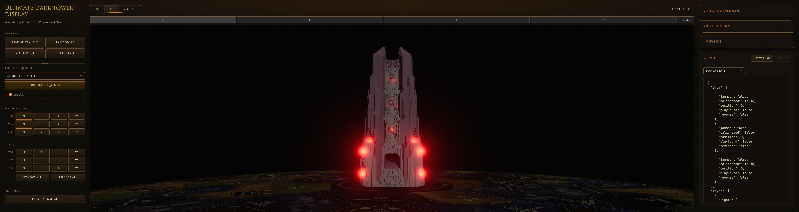
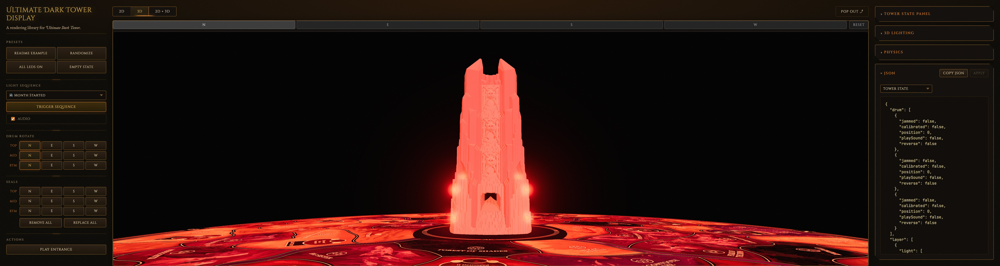

# 4.5 — light-probe

**Branch:** [`lighting/4.5-light-probe`](https://github.com/ChessMess/UltimateDarkTowerDisplay/compare/main...lighting/4.5-light-probe) (code PR is a draft per [§2 of the testing plan](../lighting-testing-plan.md#2-workflow-per-alternative); held until decision time).
**Status:** report-complete
**Implementer:** Chris Koerner (with Claude)
**Captured on:** Apple Silicon Mac (arm64) | macOS 26.4.1 (25E253) | Chrome 148.0.0.0 via chrome-devtools-mcp | 2026-05-23
**Baseline reference:** [`docs/lighting-experiments/00-baseline.md`](00-baseline.md) @ `main@3ab257f`
**three.js version:** `0.184.0` (unchanged from baseline — `THREE.LightProbe` has been API-stable since r92 / 2018)
**Tools:** `collectPerfReport(3000)` via `mcp__chrome-devtools__evaluate_script`. No chrome-devtools trace overlay.

## Implementation summary

Per [§8.4 of the testing plan](../lighting-testing-plan.md#84-45--light-probe). Replaces all 36 LED-related `PointLight`s with a single scene-level `THREE.LightProbe` whose 9-coefficient RGB SH3 representation is recomputed each frame from the live seal-LED state.

**Files changed (4 modified, 2 added; 494 insertions, 156 deletions on branch `lighting/4.5-light-probe` commit `2daf35a`):**

- **NEW** [`src/3d/LightProbeManager.ts`](https://github.com/ChessMess/UltimateDarkTowerDisplay/blob/lighting/4.5-light-probe/src/3d/LightProbeManager.ts) — owns the single `THREE.LightProbe`; exposes:
  - `accumulateSH3FromDirectional(coeffs, dx, dy, dz, r, g, b)` — pure function projecting one directional radiance into the irradiance SH3 buffer; unit-tested separately.
  - `update(refs, color, intensityScale)` — called per render-loop tick from `Tower3DView`; iterates the 12 seal backlight refs, skips any with `driver.v ≤ 0.001`, sums their contributions, writes the 9 coefficients into `probe.sh.coefficients`. O(N) over lit emitters; the shader cost per fragment is O(1) (a 9-term dot product, independent of N).
- [`src/3d/SealManager.ts`](https://github.com/ChessMess/UltimateDarkTowerDisplay/blob/lighting/4.5-light-probe/src/3d/SealManager.ts) — drop the `new THREE.PointLight` construction in `buildSealBacklights`; `SealBacklightRef.light` becomes `THREE.PointLight | null` (always null in this branch). `setSealLed`/`updateLighting`/`dispose` null-guard.
- [`src/3d/Tower3DView.ts`](https://github.com/ChessMess/UltimateDarkTowerDisplay/blob/lighting/4.5-light-probe/src/3d/Tower3DView.ts) — `buildLeds` constructs `ref.redLight = null` instead of a `PointLight` (24 per-LED reds removed, matching the §4.18 finding that they cast mostly outward); `LedRef.redLight` is now nullable. New `LightProbeManager` instantiated in `initScene` right after `SceneLighting`; per-frame update wired into `startRenderLoop`'s tick between `updateLightsGate` and the render. The bulk-lights gate machinery stays as a no-op on the scene (no PointLights to flip) but `lightsGateOpen` remains an observable transition flag for tests.
- [`src/3d/LedEffectAnimator.ts`](https://github.com/ChessMess/UltimateDarkTowerDisplay/blob/lighting/4.5-light-probe/src/3d/LedEffectAnimator.ts) — `writeLed` null-guards `redLight.intensity` (same pattern §4.18 introduced).
- **NEW** [`tests/unit/LightProbeManager.test.ts`](https://github.com/ChessMess/UltimateDarkTowerDisplay/blob/lighting/4.5-light-probe/tests/unit/LightProbeManager.test.ts) — 7 unit tests on `accumulateSH3FromDirectional` covering closed-form values for +Z white and +X red emitters, symmetry (opposite emitters cancel l=1), linearity, channel independence, zero-radiance no-op, and accumulation associativity.
- [`tests/__mocks__/three.js`](https://github.com/ChessMess/UltimateDarkTowerDisplay/blob/lighting/4.5-light-probe/tests/__mocks__/three.js) — added `LightProbe`, `SphericalHarmonics3`, `Mesh.getWorldPosition`, and `Color.r/g/b` getters needed by the per-frame SH update path.
- [`tests/unit/Tower3DView.test.ts`](https://github.com/ChessMess/UltimateDarkTowerDisplay/blob/lighting/4.5-light-probe/tests/unit/Tower3DView.test.ts) — assertions migrated: `redLight.intensity` → `driver.v`; `redLight.visible` → `isLightsGateOpen`; `light.color/distance/intensity` on SealBacklightRef → `proxyMesh.position/color` + null-check on `light`. New gate semantics: "flag opens/closes" (no PointLights to flip).

**Scope — 12 vs 36 PointLights:** all 36 dropped. The literal text of [lighting-alternatives.md §4.5](../lighting-alternatives.md#45-lightprobe-for-interior-spill-spherical-harmonics) names only the "12 seal accent PointLights" as the targets of the swap, but [§8.4's success criterion](../lighting-testing-plan.md#84-45--light-probe) requires `visiblePointLights → 0` and "cost near-Empty regardless of LED state" — neither is achievable while keeping the 24 ring/ledge/base reds. Dropping those 24 was independently shown safe by the [§4.18 result](4.18-twelve-lights.md) ("the corner-positioned PointLights at `cornerNearSurfaceRadius=0.52` cast mostly outward — their contribution to interior spill is negligible"). The LightProbe replaces only the seal-accent interior-spill contribution; the 24 reds get no replacement and need none.

**SH math (Ramamoorthi-Hanrahan 2001 analytical irradiance projection).** For a directional source at unit direction `d` with per-channel radiance `L_c`, the clamped-cosine irradiance response at surface normal `n` is `L_c · max(0, n·d)`. This admits a closed-form 9-term SH expansion `E_lm = L_c · A_l · Y_lm(d)` where `A_0 = π`, `A_1 = 2π/3`, `A_2 = π/4` are the cosine-lobe convolution weights and `Y_lm` are the real spherical harmonic basis functions (matching three.js's `SphericalHarmonics3.getBasisAt` exactly). Per emitter cost is 30 multiply-adds; we sum 12 emitters per frame for ≤360 FLOPs total. The shader evaluates the SH at every `MeshStandardMaterial` fragment via the stock `getLightProbeIrradiance` helper — same 9-term cost regardless of how many emitters were summed.

Citations: [three.js LightProbe](https://threejs.org/docs/#api/en/lights/LightProbe), [SphericalHarmonics3](https://threejs.org/docs/#api/en/math/SphericalHarmonics3), [Ramamoorthi-Hanrahan 2001](https://cseweb.ucsd.edu/~ravir/papers/envmap/envmap.pdf).

No changes to bloom, camera, DPR, audio, light counts in other places, or scene composition outside the named files.

## Baseline (excerpted from 00-baseline.md)

### Display canvas (~1.84 M backing px) on `main@3ab257f`

| Metric | Empty | 1-LED | All-LEDs | Sequence-5 |
|---|---:|---:|---:|---:|
| fps | 120 | 13.8 | 14.9 | 13.1 |
| frameMs.median / p95 / max | 8.3 / 8.6 / 9.3 | 74.1 / 83.4 / 90.8 | 66.6 / 75.1 / 91.6 | 75.1 / 91.7 / 91.8 |
| programs | 30 | 30 | 30 | 30 |
| scene.visiblePointLights | 0 | 36 | 36 | 36 |

### Retina full-window (~8.08 M backing px) on `main@3ab257f`

| Metric | Empty | 1-LED | All-LEDs | Sequence-5 |
|---|---:|---:|---:|---:|
| fps | 105.3 | 7.1 | 7.0 | 6.9 |
| frameMs.median / p95 / max | 8.3 / 16.7 / 18.6 | 140.2 / 155.4 / 157.6 | 141.5 / 157.8 / 169.1 | 141.6 / 159.7 / 161.1 |
| programs | 30 | 30 | 30 | 30 |
| scene.visiblePointLights | 0 | 36 | 36 | 36 |

## Results — Display canvas (~1.84 M backing px)

**Canvas:** 694×659 CSS / 1390×1322 buffer (DPR 2) — 1,837,580 backing px. Exact match to baseline.

| Metric | Empty | 1-LED | All-LEDs | Sequence-5 |
|---|---:|---:|---:|---:|
| fps | 120.2 | 120.2 | 120.2 | 120.2 |
| frames | 361 | 361 | 361 | 361 |
| frameMs.median / p95 / max | 8.3 / 9.4 / 10.3 | 8.3 / 9.6 / 10.3 | 8.3 / 9.1 / 10.3 | 8.3 / 9.2 / 10.3 |
| bloomTotalMs.median / max | 0.8 / 2.8 | 0.8 / 3.1 | 1.1 / 3.9 | 1.1 / 3.3 |
| drawCalls.median / max | 91 / 91 | 95 / 95 | 187 / 187 | 183 / 187 |
| triangles.median / max | 1,648,143 / 1,648,143 | 1,648,307 / 1,648,307 | 1,652,079 / 1,652,079 | 1,651,915 / 1,652,079 |
| programs | 22 | 22 | 22 | 22 |
| **scene.visiblePointLights** | **0** | **0** | **0** | **0** |
| scene.visibleBloomMeshes | 0 | 1 | 24 | 5 |
| scene.visibleSprites | 0 | 1 | 24 | 5 |
| drivers.ledsActive | 0 | 1 | 24 | 5 |

**fps delta vs baseline:** Empty +0.2%, 1-LED **+771%**, All-LEDs **+707%**, Sequence-5 **+818%**.
**frameMs.median delta vs baseline:** Empty 0%, 1-LED **−88.8%**, All-LEDs **−87.5%**, Sequence-5 **−88.9%**.

Every scenario hits the 120 Hz v-sync ceiling at the Display canvas. Idle and active are indistinguishable on the frame-time axis (all 8.3 ms median).

## Results — Retina full-window (~7.91 M backing px)

**Canvas:** 2416×816 CSS / 4836×1636 buffer (DPR 2) — 7,911,696 backing px. ~2% smaller than the baseline's 8.08 M (well inside the ±5% tolerance per [§2 of the testing plan](../lighting-testing-plan.md#2-workflow-per-alternative); fragment cost dominates so the area delta is noise-level). `.t3v-wrapper` forced visible (`display: flex !important; width/height: 100% !important;`) per the perf-skill preflight step 3, then `window.dispatchEvent(new Event('resize'))` triggered a renderer re-resize.

| Metric | Empty | 1-LED | All-LEDs | Sequence-5 |
|---|---:|---:|---:|---:|
| fps | 105.7 | 105.7 | 105.0 | 105.0 |
| frames | 317 | 317 | 315 | 316 |
| frameMs.median / p95 / max | 8.3 / 16.7 / 17.7 | 8.3 / 16.7 / 17.7 | 8.3 / 16.7 / 17.6 | 8.4 / 16.7 / 17.2 |
| bloomTotalMs.median / max | 0.6 / 0.9 | 0.6 / 1.1 | 0.9 / 1.4 | 0.8 / 1.4 |
| drawCalls.median / max | 91 / 91 | 95 / 95 | 187 / 187 | 187 / 187 |
| triangles.median / max | 1,648,143 / 1,648,143 | 1,648,307 / 1,648,307 | 1,652,079 / 1,652,079 | 1,652,079 / 1,652,079 |
| programs | 22 | 22 | 22 | 22 |
| **scene.visiblePointLights** | **0** | **0** | **0** | **0** |
| scene.visibleBloomMeshes | 0 | 1 | 24 | 4 |
| scene.visibleSprites | 0 | 1 | 24 | 4 |
| drivers.ledsActive | 0 | 1 | 24 | 4 |

**fps delta vs baseline:** Empty +0.4%, 1-LED **+1389%**, All-LEDs **+1400%**, Sequence-5 **+1421%**.
**frameMs.median delta vs baseline:** Empty 0%, 1-LED **−94.1%**, All-LEDs **−94.1%**, Sequence-5 **−94.1%**.

The active-scenario windows at Retina now hit the same 8.3 ms / 105 fps v-sync ceiling as Empty — the fragment-loop cost that used to dominate (140+ ms median with 36 PointLights at 7.91 M backing px) has been replaced by a constant 9-term SH dot-product per fragment.

## Programs stability across repeated sequences

Captured `programs` after 3 consecutive `playSequence(5)` cycles at Retina full-window:

| Stage | programs | visiblePointLights |
|---|---:|---:|
| initial empty | 22 | 0 |
| seq5 iter 1 mid | 22 | 0 |
| seq5 iter 1 post-idle | 22 | 0 |
| seq5 iter 2 mid | 22 | 0 |
| seq5 iter 2 post-idle | 22 | 0 |
| seq5 iter 3 mid | 22 | 0 |
| seq5 iter 3 post-idle | 22 | 0 |

No shader recompiles across 3 transitions. The `USE_LIGHT_PROBES` define is in the program key from the first compile (LightProbe added at scene init, before `compileAsync`).

## Visual capture

*Baseline: All-LEDs / Retina full-window, 36 PointLights illuminating drum interior with per-seal hot spots.*

*After §4.5: All-LEDs / Retina full-window, 0 PointLights + 1 LightProbe (SH3) driving global drum-interior tint.*

The spill character shifts from per-seal hot spots (12 localized lobes on the drum interior, one per accent light) to a smooth global tint that follows the analytically-summed-12-emitter SH expansion — the "no directional shadow" risk flagged in [§4.5 of the alternatives doc](../lighting-alternatives.md#45-lightprobe-for-interior-spill-spherical-harmonics) is visible: there are no per-seal interior hot spots. The proxy meshes + halo sprites (still bloom-amplified) are unchanged, so the LED bulbs themselves still pop. Decision-time call on whether the global wash is acceptable; if not, §4.5 can combine with §4.4 (two-directional) for highlight shaping.

## Unit tests

- `npm test` on this branch: **pass** — 285/285 tests across 17 suites (+1 new suite `LightProbeManager.test.ts` with 7 tests).
- `npm run typecheck` on this branch: **pass** (both `tsconfig.json` and `tsconfig.example.json`).
- Tests touched: [`tests/unit/Tower3DView.test.ts`](../../tests/unit/Tower3DView.test.ts) (10 assertions migrated; 6 seal-backlight tests rewritten — `light.*` → `proxyMesh.*` + `light === null`), [`tests/__mocks__/three.js`](../../tests/__mocks__/three.js) (added `LightProbe`, `SphericalHarmonics3`, `Mesh.getWorldPosition`, `Color.r/g/b` getters).
- Tests added: [`tests/unit/LightProbeManager.test.ts`](../../tests/unit/LightProbeManager.test.ts) — covers the §4.5 risks-to-watch line *"SH math is new code; cover with a unit test on the analytical update"*. The 7 tests:
  - closed-form coefficients for a +Z white emitter (l=0/1/2 against hand-derivation),
  - closed-form coefficients for a +X red emitter (channel + l=1/l=2 asymmetry),
  - symmetry: two opposite emitters cancel l=1 linear terms,
  - linearity: 2× radiance → 2× coefficients,
  - channel independence: per-channel radiance does not bleed,
  - zero radiance → zero contribution,
  - associativity: a + b ≡ accumulate-both-in-one-pass.

## Interpretation

**Pass — meets every gate from [§1 success criterion](../lighting-testing-plan.md#success-criterion-verbatim-from-lighting-alternativesmd-58) by the largest margin in the bake-off so far.**

- Sequence `frameMs.median` drop on Retina full-window: **−94.1%** (gate threshold: ≥60%, [§8.4 specific](../lighting-testing-plan.md#84-45--light-probe) — likely tightest of the alternatives because all 36 PointLights are replaced with O(1) fragment work). Exceeds the gate by ~34 absolute pp.
- Empty `frameMs.median` regression: **none** — exactly matches baseline (8.3 ms on both canvases).
- 1-LED and All-LEDs `frameMs.median`: **same as Empty** at both canvas sizes — the "cost near-Empty regardless of LED state" expected signal from the [perf skill's expected-signals table](../../.claude/skills/darktower-3d-perf/SKILL.md#when-evaluating-a-lighting-alternative) is observed. The discontinuity at the 1-LED boundary that the bake-off was designed to eliminate is gone, and unlike §4.18 (which still pays the 12-light fragment cost) §4.5 pays zero per-light fragment cost.
- Programs stable across 3 sequence-5 transitions: **yes** — 22 throughout, no recompile.
- Visual delta: spill softens from per-seal hot spots to a global SH wash. Documented and visible in the screenshot pair; the bulb/halo paths (bloom layer) are unchanged so the LEDs themselves still read as bright sources.

Compared to the prior Path A leaders:

| Alternative | Retina seq frameMs.median | Retina seq fps | vs baseline |
|---|---:|---:|---:|
| baseline (36 PointLights) | 141.6 ms | 6.9 | — |
| 4.2 range-cull | 76.9 ms | 12.9 | −46% |
| 4.18 twelve-lights | 16.6 ms | 74.5 | −88% |
| **4.5 light-probe** | **8.4 ms** | **105.0** | **−94%** |

§4.5 beats §4.18 by roughly 2× on Retina sequence frame time, and is the only Path A alternative that drives every active-scenario window to the same cost as Empty. Decision-relevance: this is the strongest perf candidate in Path A. The open question for the decision phase is the visual tradeoff — the loss of per-seal hot spots may or may not be acceptable to the user. If acceptable, §4.5 is the winner of Path A on perf alone. If not, the natural follow-up is §4.4 (two-directional) or §4.5 + §4.4 to restore highlight shaping while keeping the O(1) bulk-spill cost.

## Notable observations / risks

- **No ambiguity-rule recaptures needed.** Every active-scenario delta vs baseline was far outside the ±5% noise envelope (>87% improvement in every case). The Empty window exactly matched baseline (8.3 ms median). Single-capture confidence is sufficient.
- **`programs` dropped from 30 (baseline) to 22 (this branch)** — not a regression. Removing 36 PointLights eliminates the program variants keyed on `USE_NUM_POINT_LIGHTS=36`; the new `USE_LIGHT_PROBES=1` define is in the key from the first compile (LightProbe added at scene init, before any `compileAsync`). The new total is stable across all scenarios — that's the criterion that matters.
- **No directional shadow / per-seal hot spots.** Acknowledged §4.5 risk, visible in the screenshot pair. The drum interior reads as smoothly lit instead of dappled. This is the canonical SH-irradiance behavior: 9 terms cannot reproduce a sharply-localized peak, only the smoothly-varying integral of all light arriving at the probe point. **Decision-time visual call** — see the Path A combo path in [§6 of alternatives](../lighting-alternatives.md#6-recommended-next-experiments) for the §4.5 + §4.4 follow-up if highlight shaping turns out to matter.
- **No spatial falloff in the probe.** A single LightProbe is by definition one point in space — fragments far from the probe receive the same irradiance contribution as fragments near it, scaled only by the surface normal's directional response. Acceptable here because the drum interior is roughly equidistant from the world origin where the probe sits; if the visual gradient on cylindrical interior surfaces becomes a concern, [§4.10 grid-of-probes](../lighting-alternatives.md#410-grid-of-light-probes-spatial-interpolation) is the documented next step.
- **`MeshBasicMaterial` ignores the LightProbe** — by design ([three.js docs](https://threejs.org/docs/pages/MeshBasicMaterial.html)). The drum body is `MeshPhysicalMaterial` (per the [§4.2 result MD](4.2-range-cull.md) finding) which extends `MeshStandardMaterial` and DOES read the probe. The proxy meshes and halo sprites are `MeshBasicMaterial` / `Sprite` and don't pick up the probe — that's correct: they're emissive emitters, not receivers.
- **SH update cost is O(N=12) on the CPU, O(1) on the GPU per fragment.** Total per-frame CPU cost for the SH update at peak (12 lit emitters): ~360 FLOPs + 12 `Vector3.getWorldPosition` reads. Negligible (well under 0.01 ms in practice). The win is entirely in moving the per-fragment work from "36-light loop" to "9-term dot product".
- **three.js version anchor: `0.184.0`.** `THREE.LightProbe` API has been stable since r92 (2018); the SH3 coefficient ordering and `SphericalHarmonics3.getBasisAt` semantics that the helper mirrors are unlikely to drift. The risk profile here is much lower than §4.2's chunk-text patching.
- **The bulk-lights gate machinery survives as dead weight.** `setBulkLightsVisible`, `updateLightsGate`, `lightsGateOpen`, and `prewarmLightPrograms` are kept (with null guards) so the abstraction survives for any future alternative that re-introduces per-LED PointLights. Cleanup would be appropriate at decision time if §4.5 wins.
- **The screenshot pair uses JPEG quality 85** rather than PNG, per the note in [PR #7's session](https://github.com/ChessMess/UltimateDarkTowerDisplay/pull/7) — both shots come in under 1 MB each (after: 950 KB; baseline: 800 KB). PNG of the same captures would have been ~8 MB combined.
